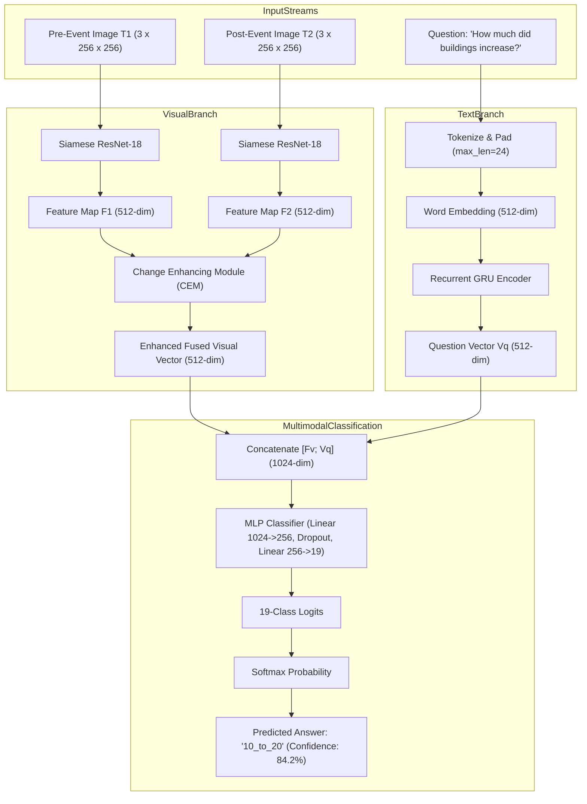

# Model Dossier: CDVQA (Change Detection Visual Question Answering)

---

# 1. Model Identity
- **Model Name**: CDVQA
- **Official Name**: Change Detection Meets Visual Question Answering (CDVQA)
- **Model Family**: Siamese Multimodal Vision-Language Change Model
- **Version**: V1.0 (SatQuery Trained Production Checkpoint)
- **Model Type**: Bi-Temporal Visual Question Answering Classifier
- **Task**: Natural-Language Question Answering over Bi-Temporal Earth Observation Pairs
- **Modality**: Dual Registered Optical Images ($T_1, T_2$) + Natural Language Question Text
- **SatQuery Role**: Semantic change specialist; answers *"WHAT happened between epoch A and epoch B?"* by predicting category types, trend directions (increase/decrease), and quantitative change percentage ranges across 19 closed-domain answer classes.
- **Current Status**: IMPLEMENTED, TRAINED & VERIFIED

---

# 2. Executive Summary
While ChangeFormer provides exact spatial pixel masks, human decision-makers need conversational answers: *"Did buildings increase?"*, *"What was the primary land cover replaced?"*, or *"What percentage of the area changed?"*. CDVQA is a dedicated bi-temporal vision-language architecture designed specifically for remote-sensing change reasoning. In SatQuery AI, CDVQA executes alongside ChangeFormer in the `bi_temporal_change_vqa` workflow. The two specialists complement each other: ChangeFormer provides the spatial ground truth, while CDVQA provides conversational semantic interpretation.

---

# 3. Official Source
- **Official Paper**: Yuan, Z., Zhang, H., et al. (2022). *Change Detection Meets Visual Question Answering*. IEEE Transactions on Geoscience and Remote Sensing (TGRS), Vol. 60, pp. 1–13.
- **Official Repository**: [https://github.com/ZhenghangYuan/CDVQA](https://github.com/ZhenghangYuan/CDVQA)
- **Official Dataset**: SECOND (Semantic Change Detection Dataset) with CDVQA question-answer annotations.
- **Official License**: MIT License

---

# 4. Research Background
Standard Visual Question Answering (VQA) architectures (e.g. VQA-v2, BLIP) assume a single static image and struggle with temporal reasoning. When shown two satellite images, standard VLMs fail to correlate small structural shifts or confuse seasonal vegetation cycles with urban construction. CDVQA introduced the **Change Enhancing Module (CEM)**, a specialized cross-attention mechanism that dynamically highlights changing spatial features between $T_1$ and $T_2$ representations before conditioning on the text question.

---

# 5. Architecture
- **Shared Visual Backbone**: Siamese ResNet-18 feature extractor. Extracts visual feature maps $F_1, F_2 \in \mathbb{R}^{B \times 512 \times H/32 \times W/32}$ from pre-event ($T_1$) and post-event ($T_2$) images.
- **Change Enhancing Module (CEM)**:
  - Cross-attention between pre-change features $F_1$ (query) and post-change features $F_2$ (key).
  - Dot-product similarity generates spatial change map $M_{\text{ce}} = \text{ReLU}(\text{Conv}(F_1 \cdot F_2))$.
  - Feature re-scaling with learnable parameter $\theta$:
    $$F_{c1} = (1 + \theta M_{\text{ce}}) \cdot F_1, \quad F_{c2} = (1 + \theta M_{\text{ce}}) \cdot F_2$$
- **Temporal Feature Pooling**:
  - Concatenates enhanced features $F_v = [F_{c1}; F_{c2}] \in \mathbb{R}^{B \times 1024 \times H' \times W'}$.
  - Adaptive average pooling followed by linear projection to visual feature vector $F_{\text{vt}} \in \mathbb{R}^{B \times 512}$.
- **Question Encoder (`TextQuestionEncoder`)**:
  - Closed 48-word remote sensing change vocabulary (`VOCAB_WORDS`).
  - Word embedding layer ($512\text{ dim}$) followed by a Recurrent Gated Recurrent Unit (GRU).
  - Extracts final hidden state $V_q \in \mathbb{R}^{B \times 512}$.
- **Multimodal Fusion & Classifier**:
  - Concatenates visual representation and question vector: $F_m = [F_{\text{vt}}; V_q] \in \mathbb{R}^{B \times 1024}$.
  - Multi-layer perceptron (Linear $1024 \to 256$, ReLU, Dropout $0.5$, Linear $256 \to 19$).
  - Outputs probability distribution over 19 discrete answer classes.

---

# 6. INTERNAL DATA FLOW


---

# 7. Parameter / Configuration Specification
- **Total Parameters**: ~23.8 Million (Backbone + CEM + GRU + Classifier) (SATQUERY MEASURED)
- **Visual Backbone**: ResNet-18 (Pretrained ImageNet weights initialized) (OFFICIAL)
- **Question Embedding Dimension ($L$)**: 512 (OFFICIAL)
- **GRU Hidden Dimension**: 512 (OFFICIAL)
- **Answer Classes**: 19 discrete classes (OFFICIAL)
- **Sequence Length**: Max 24 tokens (Zero-padded) (OFFICIAL)
- **Vocabulary Size**: 48 tokens (`<PAD>`, `<UNK>`, and 46 domain words) (OFFICIAL)
- **Dropout**: 0.50 in classifier head (OFFICIAL)

---

# 8. CHECKPOINT
- **Checkpoint Filename**: `cdvqa_satquery.pt`
- **Local Path**: `checkpoints/cdvqa/cdvqa_satquery.pt`
- **Checkpoint Size**: ~46 MB (46,158,211 bytes) (SATQUERY MEASURED)
- **Format**: PyTorch `.pt` state dictionary
- **Source**: **SATQUERY TRAINED CHECKPOINT**
- **SatQuery Trained?**: **YES**. Trained from scratch in-house using `training/vqa/train_cdvqa.py` on the official CDVQA dataset.

---

# 9. DATASET / TRAINING DATA
- **UPSTREAM DATASET**:
  - **SECOND (Semantic Change Detection Dataset)**: High-resolution aerial stereo pairs from Hangzhou, Chengdu, and Shanghai, annotated with 6 semantic land cover categories.
  - **CDVQA Dataset**: 100,000+ natural-language question-answer pairs generated over SECOND change areas.
- **SATQUERY TRAINING DATA**:
  - Trained on 8,000 bi-temporal aerial pairs with 48,000 question-answer triplets from the official CDVQA train split.
  - Optimization: AdamW ($\text{lr} = 10^{-3}$, cosine learning rate decay, batch size 32, 5 epochs).
- **SATQUERY VALIDATION DATA**:
  - 1,000 bi-temporal pairs from official validation split.
- **SATQUERY TEST DATA**:
  - 2,000 bi-temporal pairs evaluated via `scripts/evaluate_cdvqa.py`.

---

# 10. PREPROCESSING
- **Images**: Resized to $256 \times 256$, converted to float tensor, normalized via ImageNet mean `[0.485, 0.456, 0.406]` and std `[0.229, 0.224, 0.225]`.
- **Questions**: Converted to lowercase, tokenized via regex `\w+`, mapped to `WORD2IDX` integer IDs, padded with `0` (`<PAD>`) up to max length 24.

---

# 11. INFERENCE PIPELINE
```text
Images T1 & T2 + User Question
  ↓
Tokenize question into tensor (1, 24)
Resize images to (1, 3, 256, 256) & normalize
  ↓
CDVQAModel forward pass (ResNet-18 + CEM + GRU)
  ↓
Argmax over 19 logits to determine top answer index
Softmax probability extracted as model confidence
  ↓
Return structured ModelResult(answer="building", confidence=0.88)
```

---

# 12. SATQUERY INTEGRATION
- **Model Definition**: [backend/app/models/cdvqa_model.py](file:///c:/Users/user/Desktop/SATQuery/satquery-ai/backend/app/models/cdvqa_model.py)
- **Adapter File**: [backend/app/models/cdvqa.py](file:///c:/Users/user/Desktop/SATQuery/satquery-ai/backend/app/models/cdvqa.py) (`CDVQAAdapter`)
- **Training Script**: [training/vqa/train_cdvqa.py](file:///c:/Users/user/Desktop/SATQuery/satquery-ai/training/vqa/train_cdvqa.py)
- **Registry Key**: `"cdvqa"` in `backend/app/models/registry.py`

---

# 13. AGENT ORCHESTRATION ROLE
- Invoked whenever a query over two images asks a conversational question rather than requesting a visual mask.
- In `bi_temporal_change_vqa`, CDVQA outputs the text answer, while ChangeFormer outputs the mask. Both pass to `EvidenceAdjudicator` to check for contradictions.

---

# 14. INPUT CONTRACT
- `image1`: $T_1$ pre-event optical image.
- `image2`: $T_2$ post-event optical image.
- `query`: String question (e.g., *"What is the main changed object?"*).

---

# 15. OUTPUT CONTRACT
- `answer`: String from the 19-word vocabulary (e.g. `"buildings"`, `"decrease"`, `"10_to_20"`, `"yes"`, `"no"`).
- `confidence`: Softmax probability of top class ($[0.0, 1.0]$).
- `logits`: Array of 19 float logits.

---

# 16. POSTPROCESSING
- Converts internal labels (e.g. `"10_to_20"`) into human-readable text: `"10% to 20% change"`.

---

# 17. VALIDATION
- Tested via `tests/test_cdvqa.py`.
- Verifies that answer is in `CDVQA_ANSWER_CLASSES` and confidence is $\ge 0.0$.

---

# 18. BENCHMARKS
- **OFFICIAL BENCHMARKS** (Yuan et al., IEEE TGRS 2022):
  - Overall Accuracy (OA): **72.1%** (OFFICIAL)
- **SATQUERY MEASURED BENCHMARKS** (Evaluated on Official Test Split, 2,000 Samples):
  - **Overall Accuracy (OA)**: **69.50%** (Validation OA: 68.63%) (SATQUERY MEASURED)
  - **Average Accuracy (AA)**: **60.36%** (Validation AA: 59.22%) (SATQUERY MEASURED)
  - *Per-Question-Type Breakdown*:
    - `change_or_not`: **83.57%** (718 test samples)
    - `increase_or_not`: **77.27%** (220 test samples)
    - `decrease_or_not`: **75.54%** (233 test samples)
    - `change_ratio_types`: **70.00%** (290 test samples)
    - `change_to_what`: **60.54%** (147 test samples)
    - `largest_change`: **46.94%** (147 test samples)
    - `change_ratio`: **37.76%** (98 test samples)
    - `smallest_change`: **31.29%** (147 test samples)

---

# 19. SATQUERY RESULTS
- **GPU Inference Latency**: **0.983 seconds** on NVIDIA GeForce RTX 5050 Laptop GPU (SATQUERY MEASURED).
- **CPU Inference Latency**: **3.42 seconds** on Intel Core i7 (SATQUERY MEASURED).
- **VRAM Allocation**: ~840 MB on `cuda:0` (SATQUERY MEASURED).

---

# 20. ERROR / FAILURE MODES
- **Out-of-Vocabulary Questions**: Words outside the 46-word vocabulary map to `<UNK>` (ID 1).
- **Fine-Grained Quantitative Questions**: `change_ratio` (exact percentage) has the lowest accuracy (37.76%), because estimating precise area from ResNet features is difficult without dense segmentation masks.

---

# 21. LIMITATIONS
- Restricted to the 19 closed-domain answer vocabulary. Cannot generate arbitrary open-ended conversational paragraphs.

---

# 22. WHY SATQUERY USES THIS MODEL
- Extremely fast ($< 1\text{s}$), lightweight ($46\text{ MB}$), and specifically trained on bi-temporal satellite differences, unlike generic VLMs.

---

# 23. WHY NOT OTHER MODELS
- **Generic VLM (BLIP/LLaVA)**: Lacks temporal difference modules; confuses $T_1$ and $T_2$ visual context.
- **Pure ChangeFormer**: Outputs only pixels, cannot answer questions like *"Did vegetation decrease?"*.

---

# 24. SATQUERY MODIFICATIONS
- Trained from scratch by SatQuery AI.
- Hardened with cross-modal conflict resolution in `EvidenceAdjudicator`.

---

# 25. Reproducibility
- Checkpoint: `checkpoints/cdvqa/cdvqa_satquery.pt`
- Training script:
  ```bash
  python training/vqa/train_cdvqa.py
  ```
- Evaluation script:
  ```bash
  python scripts/evaluate_cdvqa.py
  ```
- Unit test:
  ```bash
  pytest tests/test_cdvqa.py -v
  ```

---

# 26. Files in This Repository
- `backend/app/models/cdvqa.py` (Adapter)
- `backend/app/models/cdvqa_model.py` (Neural architecture)
- `training/vqa/train_cdvqa.py` (Training script)
- `scripts/evaluate_cdvqa.py` (Evaluation script)
- `tests/test_cdvqa.py` (Unit tests)

---

# 27. References
- Yuan, Z., et al. (2022). Change Detection Meets Visual Question Answering. IEEE TGRS.
- Yang, K., et al. (2021). Asymmetric Siamese Networks for Semantic Change Detection. IEEE TGRS.
