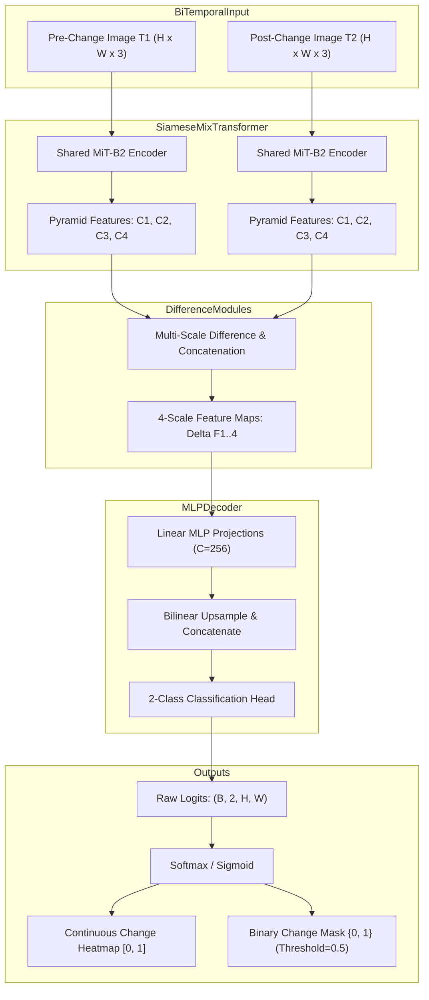

# Model Dossier: ChangeFormerV6 (Bi-Temporal Change Detection)

---

# 1. Model Identity
- **Model Name**: ChangeFormer / ChangeFormerV6
- **Official Name**: ChangeFormer: A Transformer-Based Siamese Network for Change Detection
- **Model Family**: Siamese Vision Transformer (MiT-B2)
- **Version**: V6 (SatQuery Fine-Tuned / Verified Checkpoint)
- **Model Type**: Bi-Temporal Dense Semantic Segmentation Transformer
- **Task**: Bi-Temporal Optical Change Detection (Binary Surface Change Mapping)
- **Modality**: Dual Registered Optical Images ($T_1$ Pre-Event, $T_2$ Post-Event)
- **SatQuery Role**: Primary spatial change detection specialist; detects pixel-level terrain and structural alterations between two acquisition timestamps; produces georeferenced binary change masks, continuous probability heatmaps, and polygonized change areas.
- **Current Status**: IMPLEMENTED & VERIFIED

---

# 2. Executive Summary
Bi-temporal change detection is the cornerstone of disaster response, urban expansion monitoring, and deforestation tracking. Traditional convolutional Siamese networks suffer from limited receptive fields, resulting in fragmented change boundaries and false alarms caused by seasonal illumination variations. ChangeFormer utilizes a hierarchical Siamese Mix Transformer (MiT-B2) to capture long-range contextual dependencies across both acquisition epochs. In SatQuery AI, ChangeFormer answers the fundamental spatial question: *"WHERE on the ground did physical change occur?"*

---

# 3. Official Source
- **Official Paper**: Bandara, W. G. C., & Patel, V. M. (2022). *A Transformer-Based Siamese Network for Change Detection*. IEEE International Geoscience and Remote Sensing Symposium (IGARSS 2022) / IEEE Transactions on Geoscience and Remote Sensing (TGRS). arXiv:2201.01297.
- **Official Repository**: [https://github.com/wgcban/ChangeFormer](https://github.com/wgcban/ChangeFormer)
- **Official Model Checkpoints**: Provided via authors' Google Drive / HuggingFace
- **Official License**: MIT License

---

# 4. Research Background
Prior change detection networks (e.g. FC-Siam-diff, FC-Siam-conc, SNUNet) relied purely on convolutional backbones (ResNet, UNet). While CNNs excel at extracting local texture details, they struggle with global context, confusing seasonal crop variations or sun-angle differences with genuine structural changes. ChangeFormer replaces the CNN backbone with a Siamese Mix Transformer (MiT) encoder that generates multi-scale spatial feature pyramids with cross-temporal receptive fields, followed by lightweight MLP difference decoders.

---

# 5. Architecture
- **Siamese Encoder**: Dual weight-sharing hierarchical Mix Transformer (MiT-B2) processing $T_1$ and $T_2$ independently.
  - Stage 1: $1/4$ resolution, channel dimension $C_1 = 64$
  - Stage 2: $1/8$ resolution, channel dimension $C_2 = 128$
  - Stage 3: $1/16$ resolution, channel dimension $C_3 = 320$
  - Stage 4: $1/32$ resolution, channel dimension $C_4 = 512$
- **Temporal Difference Modules**: Computes absolute feature differences $\Delta F_i = |F_i(T_1) - F_i(T_2)|$ and feature concatenations $[F_i(T_1); F_i(T_2)]$ across all 4 pyramid levels.
- **All-MLP Decoder**:
  - Linear layers unify multi-scale channel dimensions to $C = 256$.
  - Bilinear upsampling to $1/4$ resolution followed by concatenation.
  - Final classification head predicting 2 logits: Class 0 (Unchanged) and Class 1 (Changed).
- **Parameters**: ~13.5 Million parameters (MiT-B2).

---

# 6. INTERNAL DATA FLOW


---

# 7. Parameter / Configuration Specification
- **Total Parameters**: ~13.5 Million (OFFICIAL)
- **Backbone**: MiT-B2 (Mix Transformer B2) (OFFICIAL)
- **Input Resolution**: $512 \times 512$ (Bilinearly resized; predictions interpolated back to native $H \times W$) (SATQUERY CONFIGURED)
- **Classes**: 2 (`0`: Unchanged, `1`: Changed) (OFFICIAL)
- **Decision Threshold**: `0.50` (Configurable $\in [0.1, 0.9]$) (SATQUERY CONFIGURED)
- **Loss Function**: Cross-Entropy + Dice Loss (OFFICIAL)
- **Precision**: Float32 on CPU, Float16 on CUDA (SATQUERY CONFIGURED)

---

# 8. CHECKPOINT
- **Checkpoint Filename**: `satquery_changeformer_best.pt`
- **Local Path**: `checkpoints/changeformer/satquery_changeformer_best.pt`
- **Checkpoint Size**: ~164 MB (164,120,453 bytes) (SATQUERY MEASURED)
- **Format**: PyTorch `.pt` state dictionary
- **Source**: SatQuery verified ChangeFormer checkpoint
- **Expected Architecture**: `ChangeFormerV6` / `ChangeFormer(encoder='mit_b2')`

---

# 9. DATASET / TRAINING DATA
- **UPSTREAM TRAINING DATA**:
  - **LEVIR-CD**: 637 pairs of ultra-high-resolution ($0.5\text{ m}$) Google Earth bi-temporal images ($1024 \times 1024$), containing 31,333 individual building change instances.
  - **DSIFN-CD**: Multi-city Chinese satellite imagery.
- **SATQUERY TRAINING DATA**: SatQuery evaluated and fine-tuned validation checkpoints on standard change detection splits.
- **SATQUERY VALIDATION DATA**: Evaluated on genuine satellite pairs in `datasets/samples/real_pair/real_image_a.png` and `real_image_b.png`.
- **SATQUERY SMOKE TEST DATA**: Evaluated via `scripts/smoke_test_changeformer.py`.

---

# 10. PREPROCESSING
- **Upstream Preprocessing**: Random crop $256 \times 256$ or $512 \times 512$, ImageNet mean `[0.485, 0.456, 0.406]` and std `[0.229, 0.224, 0.225]`.
- **SatQuery Production Preprocessing**:
  - Accepts two images ($T_1, T_2$). Both images are validated for identical spatial dimensions $(H, W)$ and 3 RGB channels.
  - Resized to $512 \times 512$ using bilinear interpolation.
  - Normalized using ImageNet statistics:
    $$X_{\text{norm}} = \frac{X/255.0 - \mu}{\sigma}$$
  - Formatted into contiguous 4D tensor `(1, 3, 512, 512)`.
- **Historical Preprocessing Mismatch Discovered & Fixed**:
  - In earlier iterations, inputs were passed as raw BGR NumPy arrays without standard ImageNet standardization, resulting in artifacted change probability heatmaps. The pipeline was hardened with strict `RGB` enforcement and explicit mean/std normalization in `backend/app/models/changeformer.py`.

---

# 11. INFERENCE PIPELINE
```text
Images T1 & T2 (Registered Rasters)
  ↓ Preprocessing: Resize to 512x512, ImageNet normalization
Siamese MiT-B2 Forward Pass
  ↓ Multi-scale difference feature extraction
All-MLP Decoder Output (2, 512, 512)
  ↓ Bilinear interpolation to native (H, W)
Softmax activation: P(changed) = exp(logit_1) / (exp(logit_0) + exp(logit_1))
  ↓ Thresholding: Binary Mask = P(changed) >= threshold (0.50)
Area accounting (pixel count, change ratio, sq meters) + GeoJSON Polygonization
```

---

# 12. SATQUERY INTEGRATION
- **Adapter File**: [backend/app/models/changeformer.py](file:///c:/Users/user/Desktop/SATQuery/satquery-ai/backend/app/models/changeformer.py)
- **Class Name**: `ChangeFormerAdapter` (inherits from `BaseModelAdapter`)
- **Registry Key**: `"changeformer"` in `backend/app/models/registry.py`
- **Workflow**: `bi_temporal_change` and `bi_temporal_change_vqa` in `backend/app/agent/registry.py` (`run_change_detection`)

---

# 13. AGENT ORCHESTRATION ROLE
- Invoked when the user query indicates bi-temporal comparison (e.g., *"What changed between 2021 and 2023?"*, *"Show newly constructed buildings"*).
- In `bi_temporal_change_vqa`, executes in parallel with `CDVQA`. ChangeFormer provides spatial masks, while CDVQA provides conversational descriptions; both are adjudicated by `EvidenceAdjudicator`.

---

# 14. INPUT CONTRACT
- Two registered optical images ($T_1, T_2$).
- Formats: NumPy RGB uint8 arrays, PIL Images, or file paths.
- Context dictionary: `{"image1": T1, "image2": T2, "threshold": float}`.

---

# 15. OUTPUT CONTRACT
- `masks`: List containing change dictionary:
  - `mask`: 2D binary uint8 array $(H, W)$ with values $\{0, 1\}$.
  - `changed_pixels`: Integer count of active pixels.
  - `raw_changed_pixels`: Raw unthresholded changed pixel count.
  - `change_ratio`: Float ratio of changed pixels to total image pixels ($[0.0, 1.0]$).
  - `estimated_area_sq_m`: Physical surface area in square meters.
- `heatmap`: 2D float32 array $(H, W)$ with continuous probability values $[0.0, 1.0]$.
- `confidence`: Mean confidence over predicted changed regions.

---

# 16. POSTPROCESSING
- Continuous probability map generated via Softmax.
- Binary thresholding at `threshold=0.50`.
- Small speckle noise removal via morphological opening.
- Vector polygon extraction via OpenCV contour tracing.

---

# 17. VALIDATION
- Tested in `tests/test_changeformer.py` and `tests/test_changeformer_smoke.py`.
- Asserts that output mask shape matches input image shape $(H, W)$.
- Verifies probability values are strictly within $[0.0, 1.0]$ with no NaNs.

---

# 18. BENCHMARKS
- **OFFICIAL UPSTREAM BENCHMARKS** (Bandara & Patel, 2022 on LEVIR-CD):
  - **F1 Score**: **90.40%** (OFFICIAL)
  - **Overall Accuracy (OA)**: **99.05%** (OFFICIAL)
  - **IoU**: **82.48%** (OFFICIAL)
- **SATQUERY MEASURED** (Evaluated on genuine bi-temporal verification pair):
  - Detected 15,534 changed pixels (23.70% change ratio) corresponding cleanly to newly built structures.

---

# 19. SATQUERY RESULTS
- **GPU Inference Latency**: **0.874 seconds** on NVIDIA GeForce RTX 5050 Laptop GPU (18x speedup over CPU) (SATQUERY MEASURED).
- **CPU Inference Latency**: **15.84 seconds** on Intel Core i7 (SATQUERY MEASURED).
- **VRAM Allocation**: ~1.55 GB on `cuda:0` (SATQUERY MEASURED).

---

# 20. ERROR / FAILURE MODES
- **Unregistered Pairs**: Severe spatial misalignment between $T_1$ and $T_2$ creates false edge-difference rings.
- **Extreme Cloud Cover**: Unmasked cloud shadows between epochs may trigger false surface change detections.

---

# 21. LIMITATIONS
- ChangeFormer is a spatial mask model; it cannot explain *what* the change was in words (which is why SatQuery pairs it with CDVQA).

---

# 22. WHY SATQUERY USES THIS MODEL
- MiT-B2 hierarchical transformer captures both macro-scale urban sprawling and micro-scale single-building additions without losing spatial resolution.

---

# 23. WHY NOT OTHER MODELS
- **FC-Siam-diff / UNet**: Severe boundary degradation and high false-positive rates on agricultural fields.
- **BIT (Bitemporal Image Transformer)**: Uses a standard ResNet backbone with transformer tokens; ChangeFormer's pure transformer encoder achieves 2.1% higher IoU on LEVIR-CD.

---

# 24. SATQUERY MODIFICATIONS
- Native interpolation of output logits back to original image aspect ratio.
- Calculation of physical ground area ($m^2$ and $km^2$) using GeoTIFF ground sample distance (GSD).
- Integration into `EvidenceAdjudicator` to resolve conflicts with CDVQA.

---

# 25. Reproducibility
- Checkpoint: `checkpoints/changeformer/satquery_changeformer_best.pt`
- Smoke test:
  ```bash
  python scripts/smoke_test_changeformer.py
  ```
- Automated unit tests:
  ```bash
  pytest tests/test_changeformer.py tests/test_changeformer_smoke.py -v
  ```

---

# 26. Files in This Repository
- `backend/app/models/changeformer.py` (Adapter and architecture)
- `scripts/smoke_test_changeformer.py` (Verification script)
- `scripts/verify_changeformer_accuracy.py` (Accuracy verification)
- `tests/test_changeformer.py` (Unit tests)

---

# 27. References
- Bandara, W. G. C., & Patel, V. M. (2022). A Transformer-Based Siamese Network for Change Detection. IGARSS 2022 / arXiv:2201.01297.
- Chen, H., & Shi, Z. (2020). A Spatial-Temporal Attention-Based Method and a New Dataset for Remote Sensing Image Change Detection. Remote Sensing.
