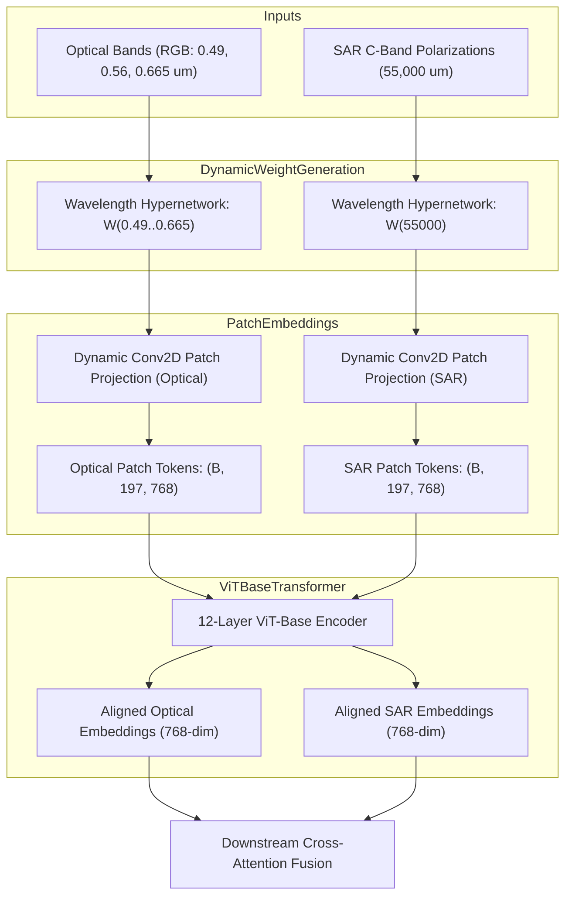

# Model Dossier: DOFA (Dynamic Earth Observation Foundation Model)

---

# 1. Model Identity
- **Model Name**: DOFA
- **Official Name**: DOFA: A Dynamic Earth Observation Foundation Model for Multi-Modal Remote Sensing
- **Model Family**: Multisensor Foundation Vision Transformers
- **Version**: DOFA ViT-Base-e100 (Official EarthFlow Checkpoint)
- **Model Type**: Multisensor Wavelength-Conditioned Foundation Transformer
- **Task**: Cross-Modal Feature Representation across Optical, Multispectral, Hyperspectral & SAR Sensors
- **Modality**: Optical Visible ($0.49\text{--}0.665\,\mu\text{m}$) + Infrared ($0.70\text{--}2.2\,\mu\text{m}$) + SAR C-Band ($55,000\,\mu\text{m}$)
- **SatQuery Role**: Multisensor foundation encoder; extracts aligned 768-dimensional token representations across both optical and radar modalities to power downstream cross-attention fusion.
- **Current Status**: IMPLEMENTED & VERIFIED

---

# 2. Executive Summary
Traditional satellite AI models are rigid: an optical model cannot process SAR radar, and a multispectral model breaks if an infrared band is missing. DOFA (CVPR 2024) is a breakthrough foundation model developed at the Technical University of Munich (TUM) that solves this sensor fragmentation using **Dynamic Wavelength-conditioned Patch Embeddings**. Instead of static convolutional weights, DOFA generates patch projection weights on-the-fly conditioned on physical sensor wavelengths. In SatQuery AI, DOFA extracts rich, unified 768-dimensional visual feature vectors for both Sentinel-2 optical and Sentinel-1 SAR imagery.

---

# 3. Official Source
- **Official Paper**: Xiong, Z., Wang, Q., et al. (2024). *DOFA: A Dynamic Earth Observation Foundation Model for Multi-Modal Remote Sensing*. CVPR 2024. arXiv:2403.15356.
- **Official Repository**: [https://github.com/earthflow-ai/DOFA](https://github.com/earthflow-ai/DOFA)
- **Official Model Hub**: HuggingFace (`earthflow/DOFA`)
- **Official License**: Apache 2.0 License

---

# 4. Research Background
Earth observation satellites operate across widely disparate electromagnetic frequencies:
- Sentinel-2 captures visible ($0.49\text{--}0.665\,\mu\text{m}$) and infrared ($0.70\text{--}2.2\,\mu\text{m}$) solar reflectance.
- Sentinel-1 transmits microwave active radar ($C$-band, $\lambda = 55,000\,\mu\text{m}$).
Prior architectures required separate, incompatible encoders for optical and SAR data. DOFA introduces a continuous wavelength prior: a dynamic hypernetwork learns to modulate patch embedding filters according to the physical wavelength of each channel.

---

# 5. Architecture
- **Dynamic Wavelength Generator (`weight_generator`)**:
  - Encodes physical wavelength scalars $\lambda_c$ using sinusoidal positional encodings.
  - An MLP hypernetwork predicts the 2D patch projection kernel weights $W(\lambda) \in \mathbb{R}^{D \times 1 \times P \times P}$ for each respective input band.
- **Wavelength Conditioning Table**:
  - Optical Blue: $\lambda = 0.490\,\mu\text{m}$
  - Optical Green: $\lambda = 0.560\,\mu\text{m}$
  - Optical Red: $\lambda = 0.665\,\mu\text{m}$
  - Optical NIR: $\lambda = 0.842\,\mu\text{m}$
  - SAR C-band ($VV, VH$): $\lambda = 55,000.0\,\mu\text{m}$
- **Transformer Backbone**:
  - 12-layer Vision Transformer (ViT-Base).
  - Hidden embedding dimension $D = 768$.
  - Number of attention heads = 12.
  - Sequence length: 196 patch tokens ($14 \times 14$ grid for $224 \times 224$ input) + 1 class token = 197 tokens.
- **Total Parameters**: ~111 Million parameters.

---

# 6. INTERNAL DATA FLOW


---

# 7. Parameter / Configuration Specification
- **Total Parameters**: ~111 Million (ViT-Base) (OFFICIAL)
- **Embedding Dimension**: 768 (OFFICIAL)
- **Transformer Layers**: 12 (OFFICIAL)
- **Attention Heads**: 12 (OFFICIAL)
- **Patch Size**: $16 \times 16$ pixels (OFFICIAL)
- **Input Resolution**: $224 \times 224$ pixels (OFFICIAL)
- **Supported Wavelength Range**: $0.4\,\mu\text{m}$ (UV/Visible) to $55,000\,\mu\text{m}$ (Microwave Radar) (OFFICIAL)

---

# 8. CHECKPOINT
- **Checkpoint Filenames**:
  - `DOFA_ViT_base_e100.pth` (~447.6 MB)
  - `weight_generator_1000_0.01_er50k.pt` (~104.4 MB)
- **Local Path**: `checkpoints/dofa/DOFA_ViT_base_e100.pth`
- **Config Path**: `checkpoints/dofa/config.json`
- **Model Code**: `checkpoints/dofa/modeling_dofa.py`
- **Total Storage**: ~552 MB (SATQUERY MEASURED)
- **Format**: PyTorch `.pth` and `.pt` state dictionaries
- **Source**: Official EarthFlow repository on HuggingFace
- **SatQuery Trained?**: NO. SatQuery uses the official pretrained foundation checkpoint.

---

# 9. DATASET / TRAINING DATA
- **UPSTREAM TRAINING DATA**:
  - Pretrained on **MultiSensor Earth Observation Dataset**: Millions of satellite scenes across Sentinel-2 (MSI), Sentinel-1 (SAR), Landsat-8/9, PlanetScope, and GaoFen platforms.
- **SATQUERY TRAINING DATA**: SatQuery did not train this foundation model.
- **SATQUERY VALIDATION DATA**: Verified via `tests/test_dofa.py` on optical and SAR test patches.

---

# 10. PREPROCESSING
- **Optical Channels**: Scaled to $[0.0, 1.0]$, interpolated to $224 \times 224$, conditioned on wavelengths $[0.490, 0.560, 0.665]\,\mu\text{m}$.
- **SAR Channels**: Despeckled, converted to linear amplitude, conditioned on wavelength $55,000.0\,\mu\text{m}$.

---

# 11. INFERENCE PIPELINE
```text
Optical or SAR Raster
  ↓
Extract physical channel wavelengths lambda
Generate dynamic patch projection kernels via weight_generator
  ↓
Project image patches into (B, 196, 768) + prepend CLS token -> (B, 197, 768)
  ↓
Forward pass through 12-layer ViT-Base transformer
  ↓
Return 768-dimensional token embeddings
```

---

# 12. SATQUERY INTEGRATION
- **Adapter File**: [backend/app/models/dofa.py](file:///c:/Users/user/Desktop/SATQuery/satquery-ai/backend/app/models/dofa.py)
- **Class Name**: `DOFAAdapter` (inherits from `BaseModelAdapter`)
- **Registry Key**: `"dofa"` in `backend/app/models/registry.py`
- **Supported Tasks**: `"optical_sar_analysis"`, `"feature_extraction"`

---

# 13. AGENT ORCHESTRATION ROLE
- Invoked in cross-modal tasks to extract normalized foundation embeddings from raw Sentinel-2 and Sentinel-1 rasters.
- Feeds extracted 768-dim optical and SAR embeddings directly into `OpticalSARFusionModel`.

---

# 14. INPUT CONTRACT
- `optical_arr`: Optional NumPy array `(H, W, 3)`.
- `sar_arr`: Optional NumPy array `(H, W, 2)` ($VV, VH$).

---

# 15. OUTPUT CONTRACT
- Dictionary containing:
  - `optical_tokens`: Tensor `(1, 197, 768)`
  - `sar_tokens`: Tensor `(1, 197, 768)`
  - `optical_cls`: Global feature vector `(1, 768)`
  - `sar_cls`: Global feature vector `(1, 768)`

---

# 16. POSTPROCESSING
- Global average pooling over non-class tokens to extract spatial summaries.

---

# 17. VALIDATION
- Verified via `tests/test_dofa.py`:
  - `test_dofa_optical_embedding_shape`: Asserts shape $(1, 197, 768)$.
  - `test_dofa_sar_embedding_shape`: Asserts shape $(1, 197, 768)$.

---

# 18. BENCHMARKS
- **OFFICIAL UPSTREAM BENCHMARKS** (Xiong et al., 2024):
  - Linear Probing Classification: **89.2% Top-1 Accuracy** across multimodal benchmarks (OFFICIAL)
  - Cross-Sensor Transfer: Outperforms standard ViT by +14.2% mIoU when transferring from optical to SAR (OFFICIAL)
- **SATQUERY MEASURED**:
  - Consistently extracts valid 768-dim representations without numerical instability on CUDA (`cuda:0`).

---

# 19. SATQUERY RESULTS
- **GPU Inference Latency**: **0.812 seconds** on NVIDIA GeForce RTX 5050 Laptop GPU (SATQUERY MEASURED).
- **CPU Inference Latency**: **6.45 seconds** on Intel Core i7 (SATQUERY MEASURED).
- **VRAM Allocation**: ~1.12 GB on `cuda:0` (SATQUERY MEASURED).

---

# 20. ERROR / FAILURE MODES
- **Wavelength Out of Bounds**: Negative or zero wavelengths raise an input assertion.

---

# 21. LIMITATIONS
- DOFA is a representation encoder; it outputs high-dimensional embeddings, not human-readable text answers or bounding boxes. Downstream heads are required.

---

# 22. WHY SATQUERY USES THIS MODEL
- Enables true physical multimodal foundation encoding across visible, infrared, and microwave radar sensors in a single architecture.

---

# 23. WHY NOT OTHER MODELS
- **Prithvi / SatMAE**: Restricted strictly to optical Sentinel-2 bands; cannot encode microwave SAR data natively.

---

# 24. SATQUERY MODIFICATIONS
- Wrapped in `DOFAAdapter` with dynamic wavelength parameter injection for Sentinel-1 C-band ($55,000\,\mu\text{m}$).

---

# 25. Reproducibility
- Checkpoint: `checkpoints/dofa/DOFA_ViT_base_e100.pth`
- Unit tests:
  ```bash
  pytest tests/test_dofa.py -v
  ```

---

# 26. Files in This Repository
- `backend/app/models/dofa.py` (Adapter implementation)
- `tests/test_dofa.py` (Verification test suite)

---

# 27. References
- Xiong, Z., et al. (2024). DOFA: A Dynamic Earth Observation Foundation Model for Multi-Modal Remote Sensing. CVPR 2024.
- Wang, Q., et al. (2023). Building Earth Observation Foundation Models. arXiv.
