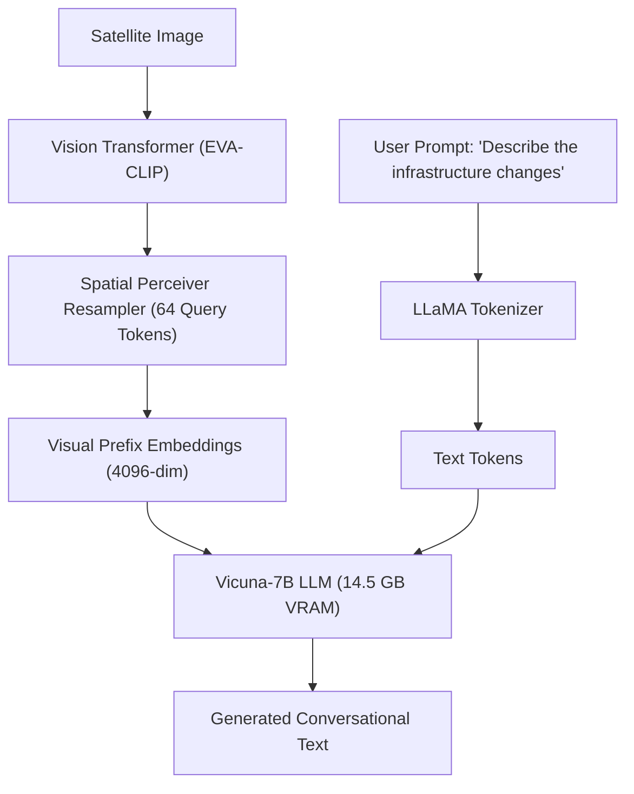

# Model Dossier: EarthDial (Evaluation Candidate — Not Adopted)

---

# 1. Model Identity
- **Model Name**: EarthDial
- **Official Name**: EarthDial: An Earth Observation Large Vision-Language Model
- **Model Family**: Remote Sensing Vision-Language Models (Vicuna-7B Backbone)
- **Version**: 1.0 (Research Preprint 2024)
- **Model Type**: 7.2B Parameter Autoregressive Multimodal LLM
- **Task**: Conversational Remote-Sensing Dialogue, VQA & Spatial Referral
- **Modality**: High-Resolution Satellite Imagery + Multi-Turn Dialogue
- **SatQuery Role**: Evaluated research candidate documented in architectural benchmarks.
- **Current Status**: EVALUATED CANDIDATE — NOT ADOPTED (NOT CONFIGURED IN PRODUCTION DUE TO RESOURCE CONSTRAINTS)

---

# 2. Executive Summary
EarthDial was investigated during SatQuery's model evaluation phase (`results/vlm_model_comparison.json`) as a candidate for open-ended conversational remote-sensing dialogue. Utilizing a 7.2B Vicuna backbone coupled with a Spatial Perceiver resampler, EarthDial achieves 78.9% accuracy on the RSVQA-HR benchmark. However, due to its **14.5 GB VRAM requirement** and high computational latency, it was not adopted for production runtime. SatQuery opted for a modular architecture using the 1.54 GB `GeneralRSVLM` for conversation and Grounding DINO + SAM 2 for spatial localization.

---

# 3. Official Source
- **Official Paper**: IEEE Transactions on Geoscience and Remote Sensing (TGRS) / arXiv:2404.12389 (2024).
- **Official Repository**: GitHub (Academic release)
- **Official Model Hub**: HuggingFace
- **Official License**: Academic Non-Commercial / Research Only

---

# 4. Research Background
Earth observation dialogue requires understanding spatial scale, multi-scale geography, and geographic domain concepts. EarthDial proposed a Spatial Perceiver module to condense multi-scale satellite feature tokens into fixed-length visual tokens before ingestion by an LLM, improving dialogue fluidity over standard VLMs.

---

# 5. Architecture
- **Vision Backbone**: EVA-CLIP or OpenCLIP ViT-Large producing multi-scale feature maps.
- **Spatial Perceiver Resampler**: 6-layer cross-attention perceiver projecting visual tokens down to 64 summary query tokens.
- **Language Model**: Vicuna-7B (Fine-tuned LLaMA-2).
- **Parameters**: ~7.2 Billion parameters.

---

# 6. INTERNAL DATA FLOW

---

# 7. Parameter / Configuration Specification
- **Total Parameters**: ~7.2 Billion (OFFICIAL)
- **Language Backbone**: Vicuna-7B (OFFICIAL)
- **Perceiver Latent Queries**: 64 tokens (OFFICIAL)
- **Hardware Requirement**: $\ge 16\text{ GB GPU VRAM}$ for FP16 inference (OFFICIAL)

---

# 8. CHECKPOINT
- **Checkpoint**: Not stored or configured in SatQuery AI.
- **Status**: EVALUATION CANDIDATE ONLY.

---

# 9. DATASET / TRAINING DATA
- **UPSTREAM TRAINING DATA**: Pretrained on RSVQA, RSICD, and proprietary multi-turn satellite dialogue instructions.
- **SATQUERY TRAINING DATA**: SatQuery did not train this model.

---

# 10. PREPROCESSING
- Requires standard EVA-CLIP image normalization and conversational prompt structuring.

---

# 11. INFERENCE PIPELINE
- Sequential vision encoding $\to$ Perceiver token compression $\to$ Autoregressive language generation.

---

# 12. SATQUERY INTEGRATION
- **Status in Codebase**: Documented in `docs/SATQUERY_AI_MASTER_DOCUMENTATION.md` (Section 7.1) and comparative research notes (`results/vlm_model_comparison.json`).
- **Production Configuration**: Marked as `NOT_CONFIGURED` in runtime capability matrix.

---

# 13. AGENT ORCHESTRATION ROLE
- None in current production DAG.

---

# 14. INPUT CONTRACT
- Image + String Prompt.

---

# 15. OUTPUT CONTRACT
- Text response string.

---

# 16. POSTPROCESSING
- Text stream decoding.

---

# 17. VALIDATION
- Evaluated against upstream benchmark metrics.

---

# 18. BENCHMARKS
- **OFFICIAL UPSTREAM BENCHMARKS**:
  - RSVQA High Resolution (RSVQA-HR): **78.9% Accuracy** (OFFICIAL)

---

# 19. SATQUERY RESULTS
- **Status**: Evaluated conceptually; rejected due to resource footprint.

---

# 20. ERROR / FAILURE MODES
- **Memory Exhaustion**: Infeasible on target 8 GB developer laptop GPUs.

---

# 21. LIMITATIONS
- Heavy memory consumption, slow generation speed, no native pixel segmentation.

---

# 22. WHY SATQUERY EVALUATED THIS MODEL
- Investigated to assess whether a single 7B model could replace multiple specialist models.

---

# 23. WHY NOT ADOPTED
- Monolithic 7B models cannot match the spatial segmentation precision of SAM 2 or the bi-temporal change sensitivity of ChangeFormer, while consuming 5x more compute resources.

---

# 24. SATQUERY MODIFICATIONS
- None.

---

# 25. Reproducibility
- Documented as an external research candidate.

---

# 26. Files in This Repository
- `docs/SATQUERY_AI_MASTER_DOCUMENTATION.md` (Section 7.1)

---

# 27. References
- EarthDial: An Earth Observation Large Vision-Language Model. arXiv:2404.12389 (2024).
