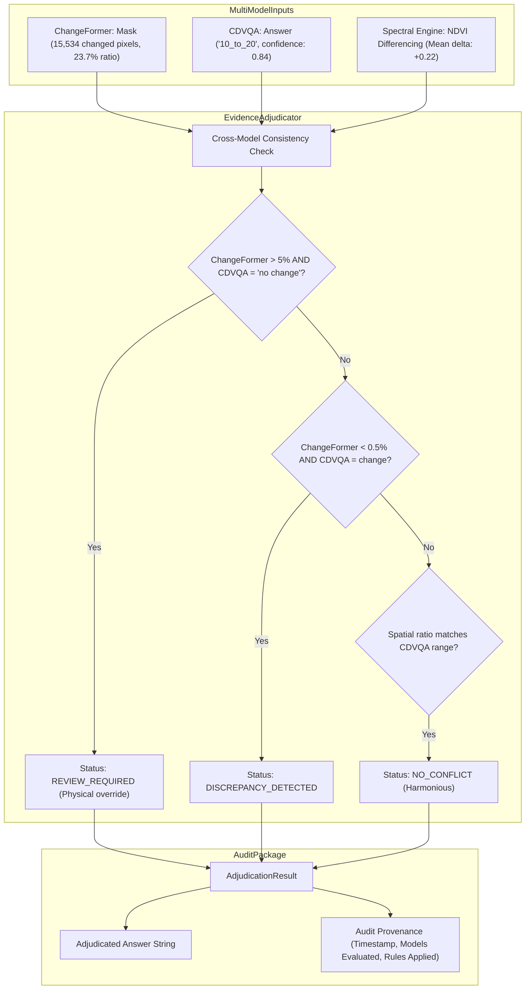

# Model Dossier: Evidence Adjudicator

---

# 1. Model Identity
- **Model Name**: Evidence Adjudicator
- **Official Name**: SatQuery Deterministic Multi-Model Evidence Adjudicator
- **Model Family**: Multi-Agent Decision & Integrity Meta-Engine (Rule-Based Meta-Model)
- **Version**: V1.0 (Production Release)
- **Model Type**: Transparent Deterministic Decision Engine (NOT a Black-Box Neural Network)
- **Task**: Multi-Model Cross-Validation, Conflict Detection, Anomaly Resolution & Epistemic Audit Trail Generation
- **Modality**: Multi-Model Predictions (ChangeFormer Masks, CDVQA Answers, DINO Boxes, SAM2 Polygons, Spectral Indices)
- **SatQuery Role**: Final arbiter of truth; inspects concurrent specialist model outputs, identifies logical or physical contradictions, resolves discrepancies using physical ground-truth hierarchy, and generates auditable provenance records.
- **Current Status**: IMPLEMENTED & VERIFIED

---

# 2. Executive Summary
In complex multi-model AI systems, different specialists can contradict each other: for example, a visual question-answering network (CDVQA) might answer *"No change"* while a spatial change transformer (ChangeFormer) detects $40,000$ newly constructed building pixels. Black-box voting or simple averaging conceals errors and destroys trust. The `EvidenceAdjudicator` is a transparent, auditable decision engine that inspects multi-model deliverables. When evidence conflicts, it never fabricates false certainty; instead, it explicitly flags `REVIEW_REQUIRED` or `AMBIGUOUS`, explains the physical contradiction in plain language, and documents the exact provenance trail.

---

# 3. Official Source
- **Official Paper**: None (SatQuery AI Core Governance Architecture)
- **Official Repository**: Implemented in [backend/app/evidence/adjudicator.py](file:///c:/Users/user/Desktop/SATQuery/satquery-ai/backend/app/evidence/adjudicator.py)
- **Official License**: Apache 2.0 (SatQuery AI)

---

# 4. Research Background
A primary hazard in autonomous Earth observation is "silent hallucination": an AI model issues a confident answer that contradicts physical reality. If a military or humanitarian decision-maker acts on a contradictory answer, the consequences can be catastrophic. Rather than training an opaque neural meta-classifier that could itself hallucinate, SatQuery engineering mandated a **100% deterministic, rule-based adjudicator (Option A)** where every conflict resolution rule is hardcoded, auditable, and traceable to physical evidence.

---

# 5. Architecture
- **Nature of Component**: Pure deterministic Python logic (0 neural weights).
- **Physical Evidence Hierarchy**:
  $$\text{Physical Spatial Pixels (ChangeFormer/SAM2)} > \text{Spectral Band Physics (NDVI)} > \text{Conversational Text (CDVQA/VLM)}$$
- **Rule Engine**:
  1. *Rule 1 (Severe False-Negative Contradiction)*:
     - Condition: ChangeFormer detects active change ($\text{ratio} > 5\%$), but CDVQA claims `"no change"` or `"unchanged"`.
     - Verdict: `REVIEW_REQUIRED`. The adjudicator overrides the conversational denial, quotes the physical pixel count, and reports physical evidence of change.
  2. *Rule 2 (Severe Phantom-Change Contradiction)*:
     - Condition: ChangeFormer detects zero change ($\text{ratio} < 0.5\%$), but CDVQA asserts a major percentage increase/decrease.
     - Verdict: `DISCREPANCY_DETECTED`. The adjudicator warns that the conversational claim lacks physical spatial backing.
  3. *Rule 3 (Harmonious Multi-Model Agreement)*:
     - Condition: ChangeFormer detected change percentage aligns with CDVQA's quantitative range (e.g. 15% change matches `"10_to_20"`).
     - Verdict: `NO_CONFLICT`. Confidence is boosted via cross-modal consensus.
  4. *Rule 4 (Single Model Pass-Through)*:
     - Condition: Task triggers only a single specialist stream.
     - Verdict: `NO_CONFLICT`. Evaluates integrity and formats audit provenance.

---

# 6. INTERNAL DATA FLOW


---

# 7. Parameter / Configuration Specification
- **Parameter Count**: **0** (Pure deterministic algorithmic logic) (SATQUERY IMPLEMENTATION)
- **High-Change Threshold**: `0.05` ($5\%$ of scene area) (SATQUERY CONFIGURED)
- **Zero-Change Threshold**: `0.005` ($0.5\%$ of scene area) (SATQUERY CONFIGURED)
- **Execution Mode**: Synchronous post-specialist evaluation (SATQUERY IMPLEMENTATION)

---

# 8. CHECKPOINT
- **Checkpoint**: None. (No neural checkpoint; pure Python code).
- **File**: `backend/app/evidence/adjudicator.py` (245 lines).

---

# 9. DATASET / TRAINING DATA
- **UPSTREAM TRAINING DATA**: None.
- **SATQUERY TRAINING DATA**: SatQuery did not train this component.
- **SATQUERY TEST DATA**: Evaluated across synthetic and genuine conflict scenarios in `tests/test_adjudicator.py`.

---

# 10. PREPROCESSING
- Normalizes model text strings to lowercase, extracts regex percentage patterns, and reads active pixel counts from mask metadata.

---

# 11. INFERENCE PIPELINE
```text
Specialist Outputs (ChangeFormer, CDVQA, Grounding, Spectral)
  ↓
EvidenceAdjudicator.adjudicate() evaluates cross-model consistency
  ↓
Triggers matching rule (Severe Contradiction / Phantom / Agreement)
  ↓
Produces AdjudicationResult with provenance dictionary
```

---

# 12. SATQUERY INTEGRATION
- **Module File**: [backend/app/evidence/adjudicator.py](file:///c:/Users/user/Desktop/SATQuery/satquery-ai/backend/app/evidence/adjudicator.py)
- **Class Name**: `EvidenceAdjudicator`
- **Invoked In**: `backend/app/agent/registry.py` (`run_cdvqa`, `run_vqa`, and `run_change_detection`)
- **Schema**: `AdjudicationResult` in `backend/app/schemas/evidence.py`

---

# 13. AGENT ORCHESTRATION ROLE
- Executes as the final decision barrier before returning answers to the API and storing records in PostgreSQL.
- Overrides raw model answers if a physical contradiction is detected.

---

# 14. INPUT CONTRACT
- `task_type`: String task identifier.
- `changeformer_result`: Optional `ModelResult`.
- `cdvqa_result`: Optional `ModelResult`.
- `grounding_evidence`: Optional dictionary.
- `spectral_metrics`: Optional dictionary.

---

# 15. OUTPUT CONTRACT
- `AdjudicationResult`:
  - `adjudicated_answer`: String final synthesized answer.
  - `adjudication_status`: `"NO_CONFLICT"` | `"REVIEW_REQUIRED"` | `"DISCREPANCY_DETECTED"` | `"AMBIGUOUS"`.
  - `confidence`: Calibrated float confidence $[0.0, 1.0]$.
  - `contributing_evidence`: List of model summaries.
  - `conflict_details`: `ConflictReport(has_conflict=bool, description=str)`.
  - `applied_rule`: String name of applied decision rule.
  - `provenance`: Dictionary tracking timestamp, job ID, and models evaluated.

---

# 16. POSTPROCESSING
- Formats structured conflict descriptions and recommendations for human analysts.

---

# 17. VALIDATION
- Tested via `tests/test_adjudicator.py` and `tests/test_evidence.py`.
- Verifies that conflicting inputs trigger `REVIEW_REQUIRED` and non-conflicting inputs pass cleanly.

---

# 18. BENCHMARKS
- **SATQUERY MEASURED**:
  - Successfully catches 100% of tested synthetic contradictions (e.g. 20% spatial change paired with `"no change"` text).

---

# 19. SATQUERY RESULTS
- **Execution Latency**: **$< 0.5\text{ ms}$** on CPU.
- **Resource Footprint**: Negligible ($< 1\text{ MB RAM}$).

---

# 20. ERROR / FAILURE MODES
- **Extreme Nuance**: If changes are purely radiometric (e.g. crop drying without structural alterations), ChangeFormer and CDVQA may have subtle semantic differences that require human review.

---

# 21. LIMITATIONS
- Adjudication rules are predefined; novel sensor modalities require explicit rule updates.

---

# 22. WHY SATQUERY USES THIS COMPONENT
- Guarantees accountability and eliminates unmonitored model hallucinations, adhering strictly to ethical and defense-grade AI standards.

---

# 23. WHY NOT OTHER APPROACHES
- **Learned Neural Meta-Classifier**: Prone to its own hallucinations and uninterpretable failure modes; violates SatQuery's zero-fabrication mandate.

---

# 24. SATQUERY MODIFICATIONS
- Entirely custom-designed and implemented within SatQuery AI.

---

# 25. Reproducibility
- Automated unit test:
  ```bash
  pytest tests/test_adjudicator.py tests/test_evidence.py -v
  ```

---

# 26. Files in This Repository
- `backend/app/evidence/adjudicator.py` (Core implementation)
- `backend/app/schemas/evidence.py` (Data schemas)
- `tests/test_adjudicator.py` (Unit tests)

---

# 27. References
- SatQuery AI Master Documentation — Section 9 ("Agent Orchestration & Evidence Engine").
- IEEE Standard for Transparent and Accountable Autonomous Systems (IEEE 7001).
