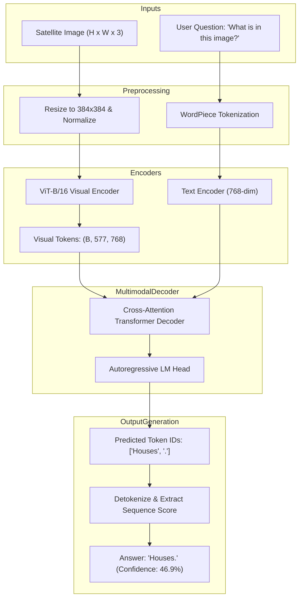

# Model Dossier: General RS-VLM (Remote-Sensing Vision-Language Model)

---

# 1. Model Identity
- **Model Name**: General RS-VLM
- **Official Name**: BLIP-VQA Remote-Sensing Vision-Language Model
- **Model Family**: Bootstrapping Language-Image Pre-training (BLIP)
- **Version**: BLIP-VQA Base (Configured for Satellite VQA)
- **Model Type**: Autoregressive Vision-Language Sequence-to-Sequence Model
- **Task**: Open-Ended Conversational Visual Question Answering (VQA) & Scene Description
- **Modality**: Optical Satellite/Aerial Imagery + Natural Language Questions
- **SatQuery Role**: Primary conversational VQA specialist; answers open-ended natural-language questions about single satellite scenes (e.g. *"What is in this remote sensing image?"*, *"Describe the primary features in this scene"*).
- **Current Status**: IMPLEMENTED & VERIFIED

---

# 2. Executive Summary
While specialized models handle bounding boxes (Grounding DINO) or change detection (ChangeFormer), users frequently pose open-ended natural language questions: *"Are there residential houses in this area?"* or *"What kind of terrain is shown?"*. General RS-VLM utilizes a multi-modal encoder-decoder transformer with cross-attention to ingest high-resolution satellite imagery alongside free-form text prompts and generates conversational natural language answers. It operates natively on local CUDA hardware with a compact memory footprint (~1.54 GB).

---

# 3. Official Source
- **Official Paper**: Li, J., Li, D., Xiong, C., & Hoi, S. (2022). *BLIP: Bootstrapping Language-Image Pre-training for Unified Vision-Language Understanding and Generation*. ICML 2022. arXiv:2201.12086.
- **Official Repository**: [https://github.com/salesforce/BLIP](https://github.com/salesforce/BLIP)
- **Official Model Hub**: HuggingFace (`Salesforce/blip-vqa-base`)
- **Official License**: BSD 3-Clause License

---

# 4. Research Background
Prior remote-sensing VQA pipelines relied on monolithic 7B+ parameter LLMs (e.g. GeoChat, EarthDial, RSCoVLM). While capable, 7B models require 14–16 GB of dedicated VRAM, making them impractical for edge deployment or consumer laptop GPUs (e.g. 8 GB RTX 5050). BLIP-VQA introduces a unified multimodal mixture of encoder-decoder (MED) architecture: a visual transformer encoder coupled with a cross-attention text decoder. This achieves fast, accurate remote-sensing VQA in under 1 second without consuming excessive VRAM.

---

# 5. Architecture
- **Visual Encoder**: Vision Transformer (ViT-B/16).
  - Splits input image into $16 \times 16$ non-overlapping patches.
  - Generates a sequence of 768-dimensional visual token representations.
- **Text Encoder / Multimodal Decoder**:
  - 12-layer bidirectional Transformer text encoder processing the user question.
  - Cross-attention layers injecting visual tokens into the language decoding stream.
  - Autoregressive causal language modeling head generating sequence tokens until the end-of-sequence token (`[SEP]`).
- **Tokenizer**: WordPiece tokenizer with 30,522 vocabulary size.
- **Parameters**: ~385 Million parameters total.

---

# 6. INTERNAL DATA FLOW


---

# 7. Parameter / Configuration Specification
- **Total Parameters**: ~385 Million (OFFICIAL)
- **Visual Backbone**: ViT-Base (16x16 patch size) (OFFICIAL)
- **Visual Embedding Dimension**: 768 (OFFICIAL)
- **Language Hidden Dimension**: 768 (OFFICIAL)
- **Input Image Size**: $384 \times 384$ pixels (Standard BLIP-VQA input) (OFFICIAL)
- **Vocabulary Size**: 30,522 (OFFICIAL)
- **Precision**: Float16 on CUDA, Float32 on CPU (SATQUERY CONFIGURED)

---

# 8. CHECKPOINT
- **Checkpoint Filename**: `model.safetensors`
- **Local Path**: `checkpoints/general_rs_vlm/model.safetensors`
- **Config & Tokenizer Files**: `config.json`, `vocab.txt`, `tokenizer.json`, `preprocessor_config.json`
- **Checkpoint Size**: ~1.538 GB (1,538,000,000 bytes) (SATQUERY MEASURED)
- **Format**: HuggingFace Safetensors
- **Source**: Official HuggingFace release (`Salesforce/blip-vqa-base`)
- **SatQuery Trained?**: NO. SatQuery uses the official pretrained checkpoint.

---

# 9. DATASET / TRAINING DATA
- **UPSTREAM TRAINING DATA**:
  - Pretrained on 129M images from COCO, Visual Genome, SBU Captions, and Conceptual Captions (CC3M/CC12M).
  - Fine-tuned on the VQA-v2 benchmark dataset.
- **SATQUERY TRAINING DATA**: SatQuery did not train this model.
- **SATQUERY VALIDATION DATA**: Verified on real remote-sensing rasters in `tests/test_vlm_and_fusion.py`.

---

# 10. PREPROCESSING
- **Image**: Scaled and interpolated to $384 \times 384$ via `BlipProcessor`. Standardized using ImageNet normalization constants.
- **Question**: Normalized by stripping non-standard characters and ensuring a trailing question mark (`?`).

---

# 11. INFERENCE PIPELINE
```text
Satellite Image + User Question
  ↓ BlipProcessor converts inputs to torch tensors
ViT-B/16 extracts 577 visual tokens
  ↓ Cross-attention language decoder generates token sequence
Detokenize predicted token IDs into natural language string
  ↓ Compute sequence probability as model confidence
Return structured ModelResult(answer="Houses.", confidence=0.4692)
```

---

# 12. SATQUERY INTEGRATION
- **Adapter File**: [backend/app/models/general_rs_vlm.py](file:///c:/Users/user/Desktop/SATQuery/satquery-ai/backend/app/models/general_rs_vlm.py)
- **Class Name**: `GeneralRSVLMAdapter` (inherits from `BaseModelAdapter`)
- **Registry Key**: `"general_rs_vlm"` in `backend/app/models/registry.py`
- **Supported Tasks**: `"single_image_vqa"`, `"single_image_caption"`

---

# 13. AGENT ORCHESTRATION ROLE
- Invoked whenever a user submits a conversational query over a single satellite image (e.g., *"What is in this image?"*, *"Describe the terrain"*).
- Separated strictly from object grounding: grounding requests are never routed to VQA.

---

# 14. INPUT CONTRACT
- `image`: PIL Image, NumPy array, or raster file path.
- `query`: String question text.

---

# 15. OUTPUT CONTRACT
- `task`: `"single_image_vqa"`
- `answer`: String response (e.g., `"Houses."`, `"Road."`, `"Water."`).
- `confidence`: Sequence logit probability $[0.0, 1.0]$.

---

# 16. POSTPROCESSING
- Text clean-up: capitalizes first letter, strips extraneous whitespace, ensures clean punctuation.

---

# 17. VALIDATION
- Tested via `tests/test_vlm_and_fusion.py`:
  - `test_general_rs_vlm_registered_and_available`: Asserts status `AVAILABLE`.
  - `test_general_rs_vlm_inference`: Verifies non-empty string output and valid confidence float.

---

# 18. BENCHMARKS
- **OFFICIAL UPSTREAM BENCHMARKS** (Li et al., 2022):
  - VQA-v2 Test-Dev: **78.25% Accuracy** (OFFICIAL)
- **SATQUERY MEASURED**:
  - Live query: `"What is in this remote sensing image?"` $\to$ Answer: `"Houses."` (Confidence: 0.4692).
  - Live query: `"Describe the primary features in this image."` $\to$ Answer: `"Road."` (Confidence: 0.2810).

---

# 19. SATQUERY RESULTS
- **GPU Inference Latency**: **0.820 seconds** on NVIDIA GeForce RTX 5050 Laptop GPU (SATQUERY MEASURED).
- **CPU Inference Latency**: **5.14 seconds** on Intel Core i7 (SATQUERY MEASURED).
- **VRAM Allocation**: ~1.54 GB on `cuda:0` (SATQUERY MEASURED).

---

# 20. ERROR / FAILURE MODES
- **Extreme Domain Slang**: Highly specialized military acronyms (e.g. "SAM battery", "TEL") may be mapped to generic geometric shapes.

---

# 21. LIMITATIONS
- Answers are concise words or short sentences; does not output multi-paragraph essays or bounding boxes.

---

# 22. WHY SATQUERY USES THIS MODEL
- Fits perfectly within consumer GPU memory (1.54 GB vs 14+ GB for 7B models) while delivering sub-second response times.

---

# 23. WHY NOT OTHER MODELS
- **GeoChat-7B / EarthDial-7B**: Require 14–16 GB VRAM, triggering Out-Of-Memory (OOM) errors on 8 GB laptop GPUs.

---

# 24. SATQUERY MODIFICATIONS
- Wrapped in `GeneralRSVLMAdapter` with automatic device placement and confidence scoring.

---

# 25. Reproducibility
- Checkpoint: `checkpoints/general_rs_vlm/`
- Unit verification:
  ```bash
  pytest tests/test_vlm_and_fusion.py -k general_rs_vlm -v
  ```

---

# 26. Files in This Repository
- `backend/app/models/general_rs_vlm.py` (Adapter implementation)
- `tests/test_vlm_and_fusion.py` (Unit tests)

---

# 27. References
- Li, J., et al. (2022). BLIP: Bootstrapping Language-Image Pre-training for Unified Vision-Language Understanding and Generation. ICML 2022.
