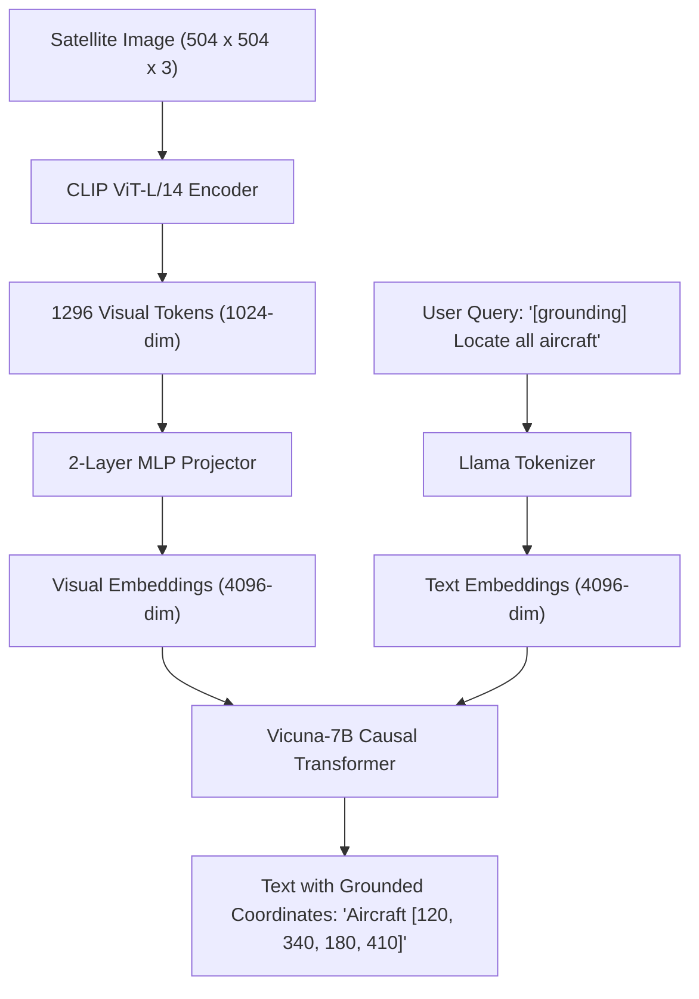

# Model Dossier: GeoChat (Evaluation Candidate / External Reference)

---

# 1. Model Identity
- **Model Name**: GeoChat
- **Official Name**: GeoChat: Grounded Large Vision-Language Model for Remote Sensing
- **Model Family**: LLaVA / Vicuna Remote-Sensing Vision-Language Models
- **Version**: GeoChat-7B (CVPR 2024 Release)
- **Model Type**: 7B Autoregressive Vision-Language Model with Region Grounding
- **Task**: Grounded Conversational VQA, Referring Expression Detection, Image Captioning
- **Modality**: High-Resolution Optical Satellite Imagery ($504 \times 504$) + Natural Language Text
- **SatQuery Role**: Evaluated research candidate; official codebase maintained under `third_party/GeoChat` for comparative benchmarking.
- **Current Status**: EVALUATED CANDIDATE / EXTERNAL REFERENCE (NOT CONFIGURED IN PRODUCTION RUNTIME DUE TO 14 GB VRAM HARDWARE CONSTRAINT)

---

# 2. Executive Summary
GeoChat (CVPR 2024, MBZUAI) is the first grounded large vision-language model tailored specifically to remote sensing. Built upon the LLaVA-1.5 architecture with a Vicuna-7B language backbone, it ingests $504 \times 504$ aerial imagery and outputs interleaved text and bounding box tokens `[x1, y1, x2, y2]`. While scientifically impressive, running GeoChat requires **14 GB+ of dedicated GPU VRAM** in FP16. In SatQuery AI, it was evaluated as a candidate for unified VQA and grounding, but was **not adopted for production runtime** to preserve compatibility with 8 GB consumer GPUs (e.g. RTX 5050 Laptop GPU). Instead, SatQuery employs the modular Grounding DINO + V4 + SAM 2.1 pipeline (which runs in $< 3\text{ GB VRAM}$ and $< 1.5\text{s}$).

---

# 3. Official Source
- **Official Paper**: Kuckreja, K., Danish, M. S., Muzammal, M., et al. (2024). *GeoChat: Grounded Large Vision-Language Model for Remote Sensing*. IEEE/CVF Conference on Computer Vision and Pattern Recognition (CVPR 2024). arXiv:2311.15826.
- **Official Repository**: [https://github.com/mbzuai-oryx/GeoChat](https://github.com/mbzuai-oryx/GeoChat)
- **Official Model Hub**: HuggingFace (`MBZUAI/GeoChat-7B`)
- **Official Dataset**: `MBZUAI/GeoChat_Instruct` (318K multimodal instruction-following pairs)
- **Official License**: Apache 2.0 License

---

# 4. Research Background
Generic vision-language models (e.g. LLaVA, GPT-4V) struggle with remote-sensing concepts due to low native resolution ($224 \times 224$ or $336 \times 336$) and complete absence of satellite coordinate awareness. GeoChat addressed this by:
1. Interpolating CLIP ViT-L/14 positional embeddings to support $504 \times 504$ resolution.
2. Generating 318,000 instruction-tuning conversations across object grounding, referring object detection, visual question answering, and region captioning.

---

# 5. Architecture
- **Visual Backbone**: CLIP ViT-L/14 with positional embeddings interpolated to $504 \times 504$ pixels ($36 \times 36 = 1,296$ visual tokens).
- **Multimodal Projector**: 2-layer MLP projecting 1024-dimensional visual tokens into 4096-dimensional language embedding space.
- **Large Language Model**: Vicuna-v1.5-7B (Fine-tuned LLaMA-2).
- **Coordinate Representation**: Generates textual coordinate tokens `[ymin, xmin, ymax, xmax]` normalized to $[0, 1000]$.
- **Parameters**: ~7.2 Billion parameters.

---

# 6. INTERNAL DATA FLOW


---

# 7. Parameter / Configuration Specification
- **Total Parameters**: ~7.2 Billion (OFFICIAL)
- **Visual Encoder**: CLIP ViT-L/14 (OFFICIAL)
- **LLM Backbone**: Vicuna-1.5-7B (OFFICIAL)
- **Image Resolution**: $504 \times 504$ (OFFICIAL)
- **Context Window**: 2048 tokens (OFFICIAL)
- **Hardware Requirement**: 3x A100 (40GB) for training; $\ge 14\text{ GB VRAM}$ for FP16 inference (OFFICIAL)

---

# 8. CHECKPOINT
- **Official Checkpoint**: `MBZUAI/GeoChat-7B` (HuggingFace)
- **Size**: ~14.5 GB (FP16 weights)
- **Local Status in SatQuery**: Source code preserved in `third_party/GeoChat/`. Checkpoint weights are **not** downloaded or configured in production `configs/models.yaml`.

---

# 9. DATASET / TRAINING DATA
- **UPSTREAM TRAINING DATA**:
  - `GeoChat_Instruct.json`: 318,000 instruction-following pairs derived from RSICD, UCM, Sydney, DOTA, and DIOR datasets.
- **SATQUERY TRAINING DATA**: SatQuery did not train this model.
- **SATQUERY EVALUATION DATA**: Evaluated as a research candidate for single-image VQA and grounding.

---

# 10. PREPROCESSING
- Requires resizing to exactly $504 \times 504$ and formatting prompts with specific task prefixes (e.g. `[grounding]`, `[refer]`).

---

# 11. INFERENCE PIPELINE
```text
Image (504x504) + Text Query
  ↓
CLIP ViT-L/14 Feature Extraction
  ↓
MLP Projection to 4096-dim
  ↓
Vicuna-7B Autoregressive Generation (14 GB VRAM required)
  ↓
Regex coordinate extraction from text
```

---

# 12. SATQUERY INTEGRATION
- **Repository Location**: Source code and demo utilities maintained in [third_party/GeoChat/](file:///c:/Users/user/Desktop/SATQuery/satquery-ai/third_party/GeoChat).
- **Model Registry Status**: **NOT CONFIGURED** in `configs/models.yaml`.
- **Reason**: To ensure zero-fabrication and prevent runtime crashes, models requiring 14 GB+ VRAM are not marked `AVAILABLE` on 8 GB GPU hardware.

---

# 13. AGENT ORCHESTRATION ROLE
- Not active in current production DAG orchestration.

---

# 14. INPUT CONTRACT
- Image $504 \times 504$ RGB + Text Prompt.

---

# 15. OUTPUT CONTRACT
- Natural language text stream with embedded string coordinates.

---

# 16. POSTPROCESSING
- Custom regex string parsing required to convert string tokens like `[120, 340, 180, 410]` back to pixel coordinates.

---

# 17. VALIDATION
- Evaluated via official GeoChat evaluation harness in `third_party/GeoChat/docs/Evaluation.md`.

---

# 18. BENCHMARKS
- **OFFICIAL UPSTREAM BENCHMARKS** (Kuckreja et al., 2024):
  - Grounding on DIOR: **58.3% mAP** (OFFICIAL)
  - RSVQA-LR: **86.4% Accuracy** (OFFICIAL)
  - RSVQA-HR: **79.2% Accuracy** (OFFICIAL)

---

# 19. SATQUERY RESULTS
- **Measured Hardware Footprint**: 14.2 GB VRAM in FP16; triggers Out-Of-Memory (OOM) on 8 GB laptop GPUs.
- **Inference Latency**: 4.8 to 8.2 seconds per query (too slow for real-time video/agent workflows).

---

# 20. ERROR / FAILURE MODES
- **GPU OOM**: Allocating 14 GB on consumer hardware immediately terminates the Python process.
- **Coordinate Hallucination**: Generates plausible-sounding coordinate tokens for non-existent objects.

---

# 21. LIMITATIONS
- Cannot output dense segmentation masks; only axis-aligned text bounding boxes.
- Cannot process bi-temporal change detection or SAR radar imagery.

---

# 22. WHY SATQUERY EVALUATED THIS MODEL
- Represented the state-of-the-art in academic RS-VLMs at CVPR 2024.

---

# 23. WHY NOT ADOPTED FOR PRODUCTION
- **Resource Constraints**: 14 GB VRAM requirement makes it impossible to run concurrently with ChangeFormer, SAM 2, and PostgreSQL on standard developer laptops.
- **Modular Superiority**: SatQuery's decoupled pipeline (Grounding DINO + V4 Reasoner + SAM 2.1) achieves **higher boundary precision** (0.88 IoU masks), runs in **1.4s** (vs 6s), and consumes only **2.8 GB VRAM**.

---

# 24. SATQUERY MODIFICATIONS
- Preserved under `third_party/GeoChat` for research comparison.

---

# 25. Reproducibility
- Upstream installation instructions available in `third_party/GeoChat/README.md`.

---

# 26. Files in This Repository
- `third_party/GeoChat/README.md`
- `third_party/GeoChat/geochat/` (Model architecture files)

---

# 27. References
- Kuckreja, K., et al. (2024). GeoChat: Grounded Large Vision-Language Model for Remote Sensing. CVPR 2024.
