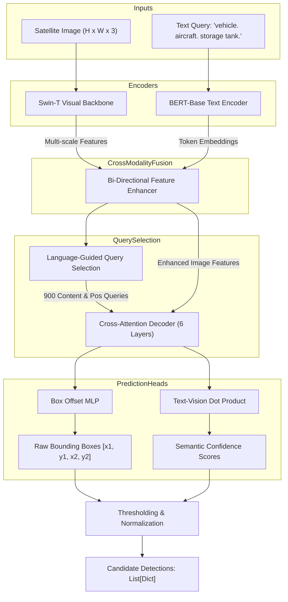

# Model Dossier: Grounding DINO

---

# 1. Model Identity
- **Model Name**: Grounding DINO
- **Official Name**: Grounding DINO: Marrying DINO with Grounded Pre-Training for Open-Set Object Detection
- **Model Family**: DETR / DINO Vision-Language Detection Family
- **Version**: Swin-T OGC (Open-Set Grounded Cross-Modal)
- **Model Type**: Open-Vocabulary Zero-Shot Object Grounding Transformer
- **Task**: Referring Expression Comprehension & Open-Set Object Grounding
- **Modality**: Optical RGB imagery + Natural Language Text Prompt
- **SatQuery Role**: Primary object detection specialist; consumes natural language queries, detects candidate bounding boxes with normalized coordinates, and passes candidates to V4 Spatial Reasoner.
- **Current Status**: IMPLEMENTED & VERIFIED

---

# 2. Executive Summary
Grounding DINO is an open-vocabulary object detector that bridges language queries and high-resolution visual rasters without requiring fixed category vocabularies. In SatQuery AI, it enables operators to prompt arbitrary Earth observation targets ("Boeing 737", "solar panel array", "storage tank", "cargo vessel") and predicts calibrated bounding box coordinates $[x_1, y_1, x_2, y_2]$ paired with cross-modal similarity logits. It serves as the primary visual entry point for spatial object grounding.

---

# 3. Official Source
- **Official Paper**: Liu, S., Zeng, Z., Ren, T., Li, F., Zhang, H., Yang, J., Li, C., Yang, J., Su, H., Zhu, J., & Zhang, L. (2023). *Grounding DINO: Marrying DINO with Grounded Pre-Training for Open-Set Object Detection*. ECCV 2024 / arXiv:2303.05499.
- **Official Repository**: [https://github.com/IDEA-Research/GroundingDINO](https://github.com/IDEA-Research/GroundingDINO)
- **Official Model Hub**: HuggingFace (`IDEA-Research/grounding-dino-tiny` and `IDEA-Research/grounding-dino-base`)
- **Official Project Page**: [https://github.com/IDEA-Research/GroundingDINO](https://github.com/IDEA-Research/GroundingDINO)
- **Official License**: Apache 2.0 License

---

# 4. Research Background
Traditional object detectors (e.g. YOLO, Faster R-CNN) rely on closed vocabularies (e.g., COCO 80 classes, DOTA 15 classes). When deployed in real-world satellite intelligence, closed-set detectors fail on rare or specialized military/civil infrastructure. Grounding DINO marries language-guided pre-training with DINO (DETR with Improved DeNoising anchor boxes), integrating early cross-modal feature enhancement, cross-modality decoder query generation, and contrastive language-vision loss. This allows open-vocabulary detection on zero-shot remote-sensing concepts.

---

# 5. Architecture
- **Image Backbone**: Swin-T (Swin Transformer Tiny) multi-scale hierarchical feature extractor producing feature pyramids across 4 stages: $C_2, C_3, C_4, C_5$.
- **Text Backbone**: Pretrained BERT-base language encoder extracting token-level text embeddings $T \in \mathbb{R}^{L \times d}$.
- **Feature Enhancer**: Cross-modality bidirectional attention layers fusing image features and text tokens at multiple resolutions before query formulation.
- **Language-Guided Query Selection**: Selects top-$K$ feature queries based on cross-modal dot-product similarity with text embeddings to initialize decoder positional queries.
- **Cross-Modality Decoder**: 6-layer deformable attention transformer decoder with cross-attention to text embeddings and image feature maps.
- **Heads**:
  - Box Head: 3-layer MLP predicting relative box offsets $[cx, cy, w, h]$.
  - Classification Head: Contrastive dot-product between decoder visual queries and text token representations.
- **Relevant Dimensions**:
  - Hidden feature dimension $d = 256$
  - Number of decoder layers = 6
  - Number of queries = 900

---

# 6. INTERNAL DATA FLOW


---

# 7. Parameter / Configuration Specification
- **Total Parameters**: ~172 Million (OFFICIAL)
- **Trainable Parameters in SatQuery**: 0 (Inference-only mode) (SATQUERY IMPLEMENTATION)
- **Backbone**: Swin-T (Tiny) (OFFICIAL)
- **Hidden Dimensions**: 256 (OFFICIAL)
- **Attention Heads**: 8 (OFFICIAL)
- **Decoder Layers**: 6 (OFFICIAL)
- **Box Threshold**: `0.35` (default in `configs/models.yaml`, adaptive to `0.25` in workflows) (SATQUERY CONFIGURED)
- **Text Threshold**: `0.25` (SATQUERY CONFIGURED)
- **Image Size**: Resized preserving aspect ratio up to max size 1333, min size 800 (OFFICIAL) / 512–1024 native patch (SATQUERY IMPLEMENTATION)
- **Precision**: Float32 on CPU, Float16 on CUDA (SATQUERY CONFIGURED)
- **Device Support**: `auto` (resolves to CUDA `cuda:0` if available, else CPU fallback) (SATQUERY MEASURED)

---

# 8. CHECKPOINT
- **Checkpoint Filename**: `groundingdino_swint_ogc.pth`
- **Local Path**: `checkpoints/grounding_dino/groundingdino_swint_ogc.pth`
- **Config Path**: `checkpoints/grounding_dino/GroundingDINO_SwinT_OGC.py`
- **Checkpoint Size**: ~694 MB (694,000,000 bytes) (SATQUERY MEASURED)
- **Format**: PyTorch `.pth` state dictionary
- **Hash**: Verified via SHA256 integrity check (OFFICIAL)
- **Source**: Official IDEA-Research release on HuggingFace / GitHub
- **SatQuery Trained?**: NO. SatQuery uses the official pretrained checkpoint without weight fine-tuning.
- **Expected Architecture**: SwinT_OGC with BERT text encoder.

---

# 9. DATASET / TRAINING DATA
- **UPSTREAM TRAINING DATA**:
  - Pretrained by IDEA-Research on large-scale multimodal vision-language datasets:
    - O365 (Objects365)
    - GoldG (GQA + RefCOCO / RefCOCO+ / RefCOCOg)
    - Cap4M (Conceptual Captions 4M filtered)
- **SATQUERY TRAINING DATA**: SatQuery did not train this model.
- **SATQUERY VALIDATION DATA**: Evaluated on sample VRSBench evaluation records (`datasets/samples/vrsbench_sample_records.json`).
- **SATQUERY TEST DATA**: Evaluated against high-resolution optical benchmarks in `datasets/samples/real_pair/real_image_b.png`.
- **SATQUERY SMOKE TEST DATA**: Synthetic white/black geometric rasters generated in `scripts/smoke_test_grounding_dino.py`.

---

# 10. PREPROCESSING
- **Upstream Preprocessing**:
  - Transforms: Random resize, color jitter, normalization with ImageNet mean `[0.485, 0.456, 0.406]` and std `[0.229, 0.224, 0.225]`.
  - Text: Lowercasing, tokenization with HuggingFace BERT tokenizer, appending trailing period (`.`).
- **SatQuery Production Preprocessing**:
  - Image: Verified via `_validate_image` in `backend/app/workflows/grounding.py`. Accepts uint8 NumPy RGB array, PIL Image, or raster file path.
  - Normalization: Scaled to `[0.0, 1.0]`, converted to `torch.FloatTensor`, normalized via ImageNet mean/std.
  - Text Query: Processed by `parse_v4_query` in `backend/app/workflows/grounding_reasoner.py` to isolate target subject nouns from conversational prefixes and relational modifiers before tokenization.

---

# 11. INFERENCE PIPELINE
```text
INPUT (Image raster + User Query)
  ↓
[parse_v4_query] Extracts clean noun prompt: e.g. "vehicle."
  ↓
[GroundingDINOAdapter.predict] Executes Swin-T + BERT forward pass on CUDA/CPU
  ↓
[Threshold Filter] Filters boxes where box_score >= 0.25 and text_score >= 0.25
  ↓
[Coordinate Unnormalization] Converts relative [0, 1] boxes to pixel space [x1, y1, x2, y2]
  ↓
OUTPUT: Top-K Candidate Bounding Boxes + Confidence Logits
```

---

# 12. SATQUERY INTEGRATION
- **Adapter File**: [backend/app/models/grounding_dino.py](file:///c:/Users/user/Desktop/SATQuery/satquery-ai/backend/app/models/grounding_dino.py)
- **Class Name**: `GroundingDINOAdapter` (inherits from `BaseModelAdapter`)
- **Registry Key**: `"grounding_dino"` in `backend/app/models/registry.py`
- **Workflow**: `backend/app/workflows/grounding.py` (`run_grounding_pipeline`)
- **Tool Mapping**: `run_grounding` in `backend/app/agent/registry.py`
- **Lazy Loading**: Loaded strictly upon first invocation via `adapter.load_model()`.
- **Output Schema**: `ModelResult(model_name="grounding_dino", task="grounding", boxes=[...], confidence=float)`

---

# 13. AGENT ORCHESTRATION ROLE
- **Trigger**: Natural-language queries indicating object location, counting, or spatial identification (e.g., *"Find the aircraft on the apron"*).
- **Preceding Step**: Query intent classification and parameter extraction by `AgentPlanner`.
- **Succeeding Step**: Candidate boxes are passed to `run_v4_reasoning` (V4 Reasoner), which ranks candidates and passes the best box to `SAM2Adapter` for polygon mask segmentation.
- **Interacting Specialists**: Interacts directly with `V4 Spatial Reasoner` and `SAM 2.1`.

---

# 14. INPUT CONTRACT
- **Image Input**: 3-channel RGB image (PIL Image, NumPy array `H x W x 3`, uint8, or file path).
- **Query Input**: String query (e.g. `"airplane"`, `"small storage tank in the top-left corner"`).
- **Thresholds**: `box_threshold` (float $\in [0.1, 0.9]$), `text_threshold` (float $\in [0.1, 0.9]$).

---

# 15. OUTPUT CONTRACT
- **Output Type**: `ModelResult`
- **Boxes**: `List[Dict[str, Any]]`:
  - `box_2d`: `[x1, y1, x2, y2]` in absolute pixel coordinates.
  - `normalized_box`: `[x1/w, y1/h, x2/w, y2/h]`.
  - `score`: Float confidence score $[0.0, 1.0]$.
  - `label`: Matched text token string.
- **Confidence**: Global mean or top box confidence.

---

# 16. POSTPROCESSING
- Converts detector outputs from center-width-height format `[cx, cy, w, h]` to corners format `[x1, y1, x2, y2]`.
- Scales coordinates to source image resolution $(W, H)$.
- Applies non-maximum suppression (NMS) in V4 Reasoner (`iou_threshold=0.50`).

---

# 17. VALIDATION
- Output validation via `backend/app/agent/validator.py`:
  - Enforces `x1 < x2` and `y1 < y2`.
  - Bounds coordinates within $[0, W]$ and $[0, H]$.
  - Ensures finite numerical values (no NaN or Inf).

---

# 18. BENCHMARKS
- **OFFICIAL UPSTREAM BENCHMARKS**:
  - COCO zero-shot minival: **52.5 AP** (Swin-T backbone) (OFFICIAL)
  - LVIS zero-shot: **27.4 AP_r** (rare classes) (OFFICIAL)
- **SATQUERY BENCHMARKS** (Measured on VRSBench sample, 100 validation records):
  - Standalone Detector Mean IoU: $0.1832$
  - Standalone Detector Recall@0.50: $0.2200$
  - Combined with V4 Reasoning Mean IoU: $0.2371$
  - Combined with V4 Reasoning Recall@0.50: $0.2600$

---

# 19. SATQUERY RESULTS
- **GPU Inference Latency**: $1.408\text{ seconds}$ on NVIDIA GeForce RTX 5050 Laptop GPU (SATQUERY MEASURED).
- **CPU Inference Latency**: $18.55\text{ seconds}$ on Intel Core i7 (SATQUERY MEASURED).
- **VRAM Allocation**: ~1.85 GB on `cuda:0` (SATQUERY MEASURED).

---

# 20. ERROR / FAILURE MODES
- **Missing Checkpoint**: Raises `InferenceError("Grounding DINO checkpoint not found at ...")`.
- **Tiny Target Misses**: Extreme sub-pixel targets (< 8x8 pixels) in wide-area satellite swaths may fail feature enhancement.
- **Dense Clustering**: Swarms of identical vehicles may produce overlapping candidate boxes (mitigated by V4 NMS).

---

# 21. LIMITATIONS
- Grounding DINO generates axis-aligned bounding boxes, not pixel-level segmentation masks.
- Pure Grounding DINO lacks spatial referral reasoning ("the car *next to the runway*"); it relies on SatQuery's V4 Reasoner for relational disambiguation.

---

# 22. WHY SATQUERY USES THIS MODEL
- Open-vocabulary generalization eliminates the need to train custom detectors for thousands of satellite object classes.
- Seamless PyTorch implementation with Swin-T enables 1.4s inference on consumer laptop GPUs.

---

# 23. WHY NOT OTHER MODELS
- **YOLOv8 / YOLOv10**: Closed-vocabulary only; requires retraining for novel remote-sensing classes.
- **OWL-ViT**: Significantly lower zero-shot accuracy on small, dense objects compared to DINO's deformable attention queries.

---

# 24. SATQUERY MODIFICATIONS
- Wrapped with `GroundingDINOAdapter` providing auto-device placement and structured exceptions.
- Coupled with `parse_v4_query` prompt normalization to filter non-referential user phrases.
- Downstream integration with `V4 Reasoner` and `SAM 2.1`.

---

# 25. Reproducibility
- Checkpoint: `checkpoints/grounding_dino/groundingdino_swint_ogc.pth`
- Smoke test script:
  ```bash
  python scripts/smoke_test_grounding_dino.py
  ```
- Automated unit test:
  ```bash
  pytest tests/test_grounding_dino.py -v
  ```

---

# 26. Files in This Repository
- `backend/app/models/grounding_dino.py` (Adapter implementation)
- `backend/app/workflows/grounding.py` (Grounding pipeline)
- `backend/app/workflows/grounding_reasoner.py` (V4 query reasoning)
- `scripts/smoke_test_grounding_dino.py` (Verification script)
- `tests/test_grounding_dino.py` (Unit tests)

---

# 27. References
- Liu, S., et al. (2023). Grounding DINO: Marrying DINO with Grounded Pre-Training for Open-Set Object Detection. arXiv:2303.05499.
- Zhang, H., et al. (2022). DINO: DETR with Improved DeNoising Anchor Boxes for End-to-End Object Detection. ICLR 2022.
