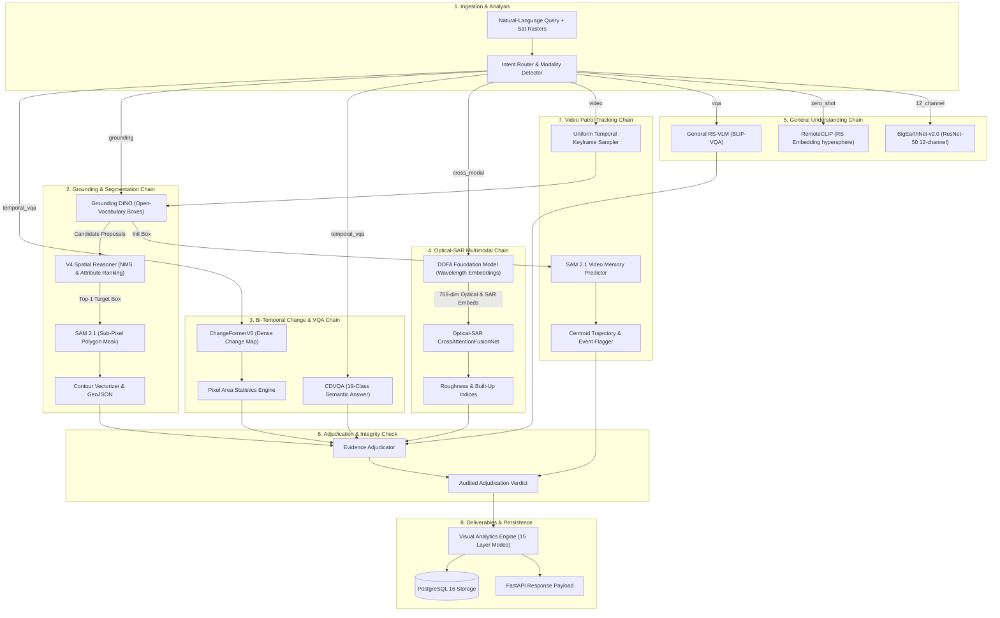

# SatQuery AI — Model Dependency Graph & Interaction Topology

This document maps the inter-model data dependencies, execution chains, and artifact transfers across the specialist neural networks and algorithmic engines in **SatQuery AI**.

---

## 1. Global Inter-Model Dependency Topology

---

## 2. Detailed Dependency Specifications

### A. Grounding $\to$ Reasoning $\to$ Segmentation
- **Source**: `GroundingDINOAdapter`
- **Payload Transferred**: List of unnormalized candidate bounding boxes `[x1, y1, x2, y2]`, detection confidence scores, and matched text labels.
- **Consumer**: `V4 Spatial Reasoner` (`run_v4_reasoning`)
- **Transformation**: Applies NMS deduplication (IoU $\ge 0.50$), evaluates spatial anchors, relative areas, dominant colors, and reference object landmarks to select exactly one target box.
- **Payload Transferred**: Single disambiguated bounding box `[x1, y1, x2, y2]`.
- **Final Consumer**: `SAM2Adapter` (`predict_mask_from_box`)
- **Terminal Deliverable**: 2D binary segmentation mask ($0/1$) and vector GeoJSON polygon.

---

### B. ChangeFormer + CDVQA $\to$ Evidence Adjudicator
- **Spatial Specialist**: `ChangeFormerAdapter` produces `change_ratio` (float), `changed_pixels` (int), and continuous probability heatmap.
- **Semantic Specialist**: `CDVQAAdapter` produces `answer` (string) and `confidence` (float).
- **Consumer**: `EvidenceAdjudicator.adjudicate()`
- **Adjudication Logic**:
  - Compares spatial change ratio against CDVQA answer semantics.
  - If ChangeFormer $> 5\%$ change and CDVQA claims `"no change"`, the adjudicator flags `REVIEW_REQUIRED` and overrides the conversational answer using physical spatial pixel evidence.
  - If harmonious, produces `adjudication_status="NO_CONFLICT"` with boosted consensus confidence.

---

### C. DOFA $\to$ Optical-SAR Cross-Attention Fusion
- **Foundation Encoder**: `DOFAAdapter` generates 768-dimensional token embeddings for optical visible bands and Sentinel-1 SAR C-band microwave backscatter ($55,000\,\mu\text{m}$).
- **Consumer**: `CrossAttentionFusionNet` in `OpticalSARFusionModel`.
- **Interaction**: Optical tokens query SAR radar tokens ($Q_{\text{opt}} \to K_{\text{sar}}, V_{\text{sar}}$) and SAR tokens query optical tokens ($Q_{\text{sar}} \to K_{\text{opt}}, V_{\text{opt}}$).
- **Terminal Deliverable**: 19-class Corine land-cover distribution, SAR surface roughness index ($[0, 1]$), and structural built-up index ($[0, 1]$).
