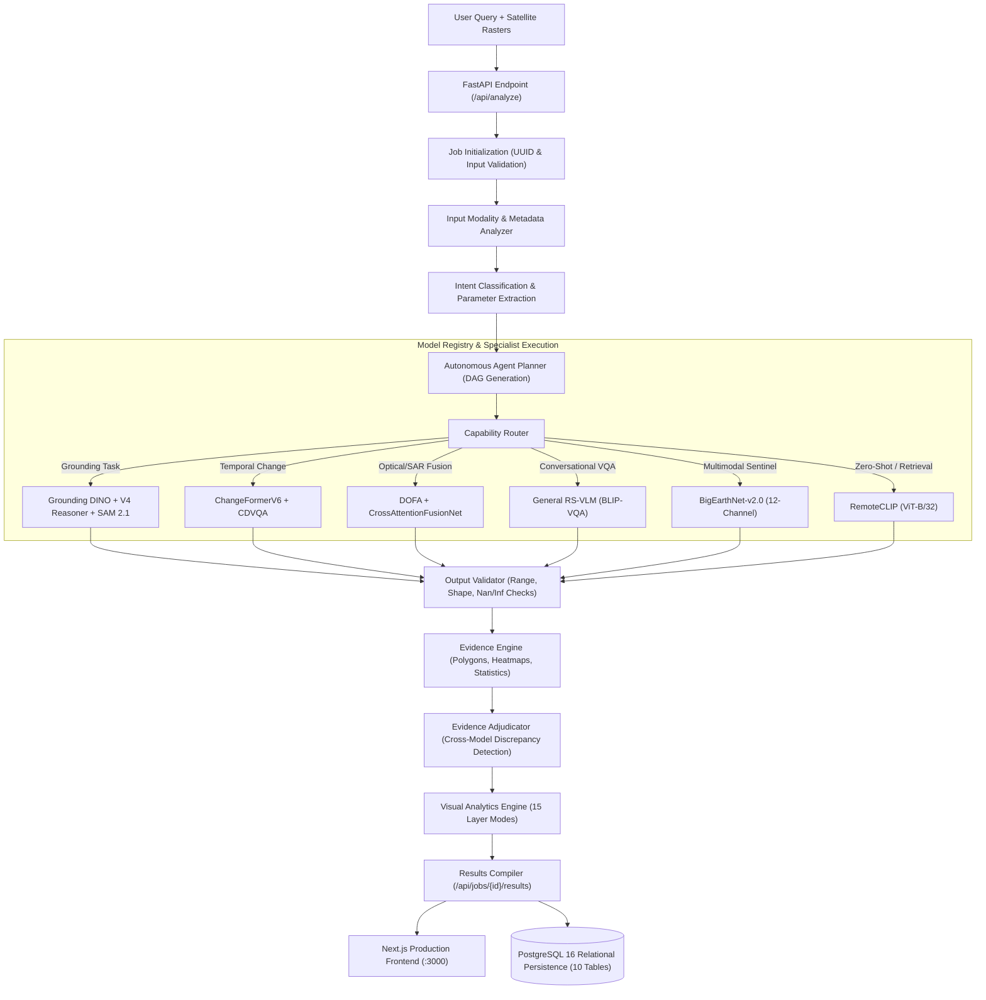
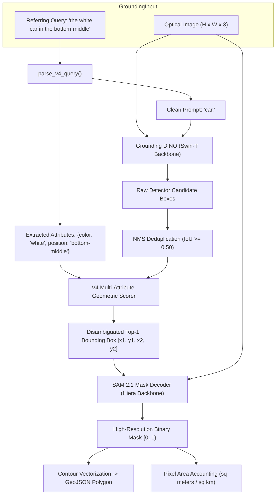
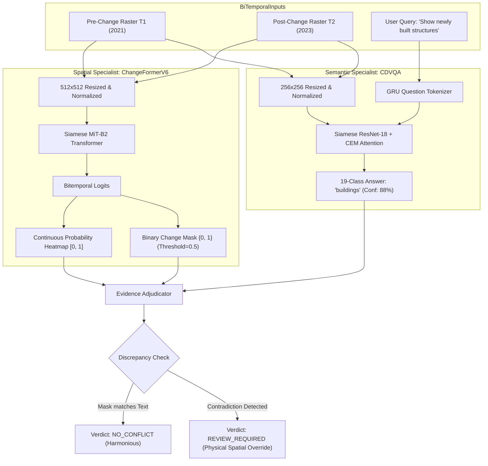
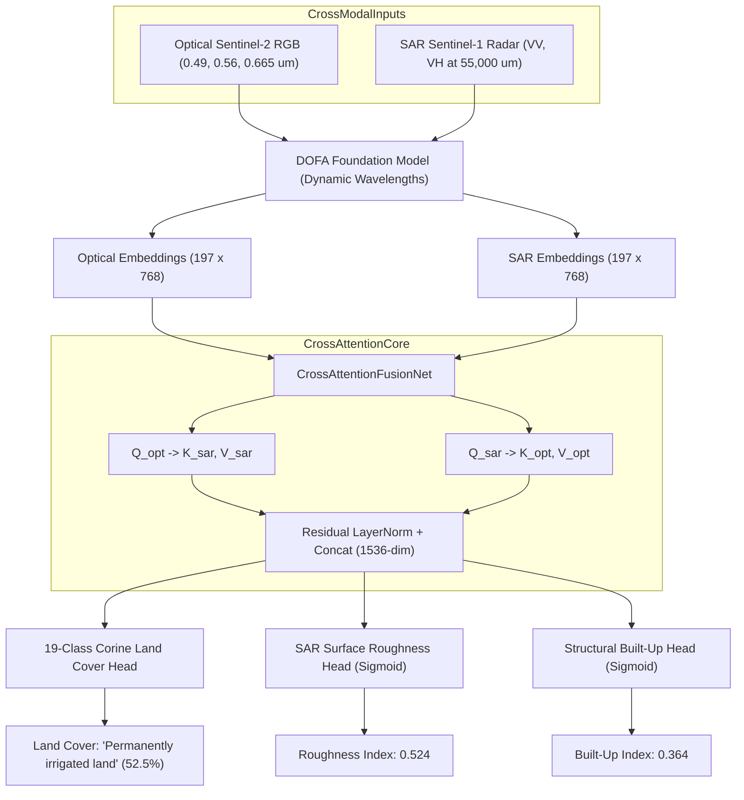
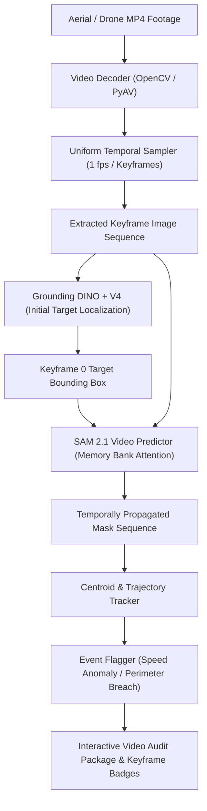

# SatQuery AI — Model Pipeline & Execution Architecture

This document diagrams the complete multi-model pipeline architecture of SatQuery AI, showing how specialist models, reasoners, evidence adjudication, and database persistence coordinate to answer complex Earth observation queries.

---

## 1. Master System Pipeline Architecture

---

## 2. Object Grounding Pipeline (Grounding DINO + V4 + SAM 2.1)

---

## 3. Bi-Temporal Change Detection & CDVQA Pipeline

---

## 4. Optical-SAR Cross-Modal Fusion Pipeline

---

## 5. Video Patrol Pipeline

