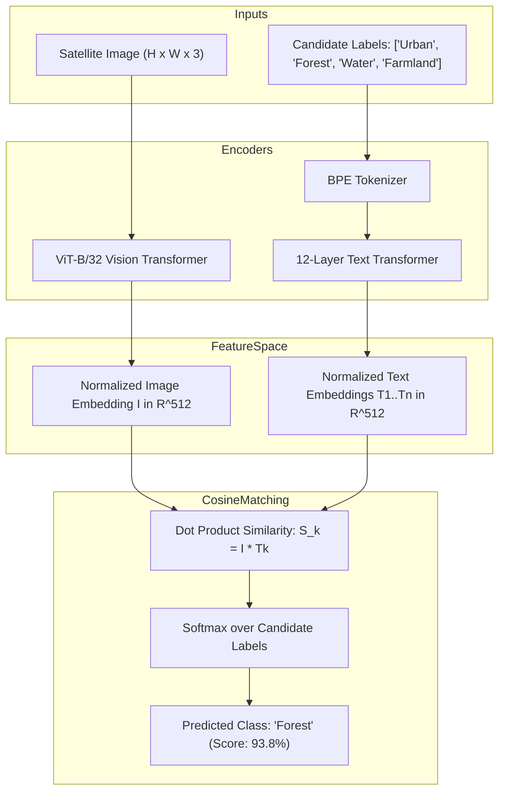

# Model Dossier: RemoteCLIP

---

# 1. Model Identity
- **Model Name**: RemoteCLIP
- **Official Name**: RemoteCLIP: A Vision Language Foundation Model for Remote Sensing
- **Model Family**: Contrastive Vision-Language Pre-training (CLIP)
- **Version**: ViT-B-32 (Remote Sensing Fine-Tuned)
- **Model Type**: Cross-Modal Vision-Language Embedding Model
- **Task**: Zero-Shot Scene Classification & Cross-Modal Text-to-Image / Image-to-Text Retrieval
- **Modality**: Optical Aerial/Satellite Imagery + Free-Form Natural Language Text
- **SatQuery Role**: Semantic retrieval and zero-shot categorization specialist; computes cross-modal cosine similarity between satellite imagery and arbitrary user category labels without retraining.
- **Current Status**: IMPLEMENTED & VERIFIED

---

# 2. Executive Summary
Standard OpenAI CLIP was pretrained on internet images (celebrities, animals, web memes) and performs poorly on nadir satellite viewpoints where "car" looks like a tiny rectangle and "forest" appears as a dense canopy texture. RemoteCLIP is the first dedicated Vision-Language foundation model tailored specifically to Earth observation, trained via contrastive learning on large-scale remote sensing image-caption datasets. In SatQuery AI, RemoteCLIP provides zero-shot classification across arbitrary candidate labels and cross-modal scene retrieval.

---

# 3. Official Source
- **Official Paper**: Chen, D., Liu, F., et al. (2024). *RemoteCLIP: A Vision Language Foundation Model for Remote Sensing*. IEEE Transactions on Geoscience and Remote Sensing (TGRS). arXiv:2306.11029.
- **Official Repository**: [https://github.com/ChenDelong1999/RemoteCLIP](https://github.com/ChenDelong1999/RemoteCLIP)
- **Official Model Hub**: HuggingFace (`chendelong/RemoteCLIP`)
- **Official License**: MIT License

---

# 4. Research Background
Earth observation imagery presents unique visual challenges: overhead orientation, scale ambiguity, dense spatial clutter, and multi-label scene semantics. Standard CLIP models fail to differentiate subtle geographic concepts (e.g., "commercial port" vs "coastal industrial zone"). RemoteCLIP overcomes this domain gap by scaling up remote sensing visual instruction and caption datasets, fine-tuning visual and text encoders to align satellite features into a shared cross-modal latent space.

---

# 5. Architecture
- **Vision Encoder**: Vision Transformer (ViT-B/32).
  - Patch size: $32 \times 32$ pixels.
  - Image embedding projection: Linear projection from transformer output tokens to 512-dimensional normalized unit hypersphere.
- **Text Encoder**: 12-layer causal Transformer encoder with masked self-attention.
  - Context length: 77 tokens.
  - Vocabulary: Byte-Pair Encoding (BPE) vocabulary of 49,408 tokens.
  - Text embedding projection: Linear projection to 512-dimensional normalized unit hypersphere.
- **Contrastive Learning Objective**: Symmetric InfoNCE loss maximizing cosine similarity between paired image and text embeddings while minimizing similarity to negative pairs:
  $$\mathcal{L} = -\frac{1}{2N} \sum_{i=1}^N \left( \log \frac{\exp(I_i \cdot T_i / \tau)}{\sum_j \exp(I_i \cdot T_j / \tau)} + \log \frac{\exp(T_i \cdot I_i / \tau)}{\sum_j \exp(T_j \cdot I_i / \tau)} \right)$$

---

# 6. INTERNAL DATA FLOW


---

# 7. Parameter / Configuration Specification
- **Total Parameters**: ~151 Million (ViT-B/32: ~88M visual + ~63M text) (OFFICIAL)
- **Embedding Dimension ($d$)**: 512 (OFFICIAL)
- **Visual Patch Size**: $32 \times 32$ (OFFICIAL)
- **Input Image Resolution**: $224 \times 224$ pixels (Standard CLIP input) (OFFICIAL)
- **Max Token Length**: 77 tokens (OFFICIAL)
- **Temperature ($\tau$)**: Learnable temperature parameter (OFFICIAL)

---

# 8. CHECKPOINT
- **Checkpoint Filename**: `RemoteCLIP-ViT-B-32.pt`
- **Local Path**: `checkpoints/remoteclip/RemoteCLIP-ViT-B-32.pt`
- **Checkpoint Size**: ~605.2 MB (605,248,129 bytes) (SATQUERY MEASURED)
- **Format**: PyTorch `.pt` model checkpoint
- **Source**: Official release from HuggingFace (`chendelong/RemoteCLIP`)
- **SatQuery Trained?**: NO. SatQuery uses the official pretrained checkpoint.

---

# 9. DATASET / TRAINING DATA
- **UPSTREAM TRAINING DATA**:
  - Pretrained on a curated mixture of remote-sensing caption datasets:
    - **RSICD** (Remote Sensing Image Captioning Dataset)
    - **RSITMD** (Remote Sensing Image-Text Match Dataset)
    - **UCM-Captions** (UC Merced Captions)
    - **Sydney-Captions**
    - Large-scale synthetic captions generated via vision-language models.
- **SATQUERY TRAINING DATA**: SatQuery did not train this model.
- **SATQUERY VALIDATION DATA**: Evaluated on sample satellite scenes in `tests/test_vlm_and_fusion.py`.

---

# 10. PREPROCESSING
- **Image**: Bicubic interpolation resize to $224 \times 224$, center crop, scaled to $[0.0, 1.0]$, standardized using CLIP mean `[0.48145466, 0.4578275, 0.40821073]` and std `[0.26862954, 0.26130258, 0.27577711]`.
- **Text**: Prompt templates formatted as `"a satellite image of [label]"` to match upstream pretraining distribution.

---

# 11. INFERENCE PIPELINE
```text
Satellite Image + List of Candidate Category Strings
  ↓
Image encoded via ViT-B/32 -> L2 normalized vector I
Text prompts encoded via Text Transformer -> L2 normalized vectors T_k
  ↓
Compute matrix product logits = I @ T.T / tau
  ↓
Softmax across candidate categories
  ↓
Return top-1 category answer and distribution
```

---

# 12. SATQUERY INTEGRATION
- **Adapter File**: [backend/app/models/remoteclip.py](file:///c:/Users/user/Desktop/SATQuery/satquery-ai/backend/app/models/remoteclip.py)
- **Class Name**: `RemoteCLIPAdapter` (inherits from `BaseModelAdapter`)
- **Registry Key**: `"remoteclip"` in `backend/app/models/registry.py`
- **Supported Tasks**: `"zero_shot_classification"`, `"cross_modal_retrieval"`

---

# 13. AGENT ORCHESTRATION ROLE
- Invoked when user queries demand zero-shot classification with custom candidate vocabularies (e.g., *"Is this scene an oil depot, solar farm, or airport?"*).
- Supplies cross-modal semantic feature embeddings for image-text retrieval.

---

# 14. INPUT CONTRACT
- `image`: PIL Image, NumPy array, or raster file path.
- `candidate_labels`: Optional list of strings (e.g. `["Urban", "Forest", "Water", "Agriculture"]`).

---

# 15. OUTPUT CONTRACT
- `ModelResult`:
  - `task`: `"zero_shot_classification"`
  - `answer`: Top predicted label string (e.g., `"Zero-shot classification: Forest"`).
  - `confidence`: Cosine similarity softmax probability.
  - `metadata`: Full score breakdown for all candidate labels.

---

# 16. POSTPROCESSING
- Logits normalized via Softmax to yield calibrated percentage probabilities.

---

# 17. VALIDATION
- Verifies embedding norm is strictly $1.0 \pm 10^{-5}$ (unit hypersphere).

---

# 18. BENCHMARKS
- **OFFICIAL UPSTREAM BENCHMARKS** (Chen et al., 2024):
  - UCM Zero-Shot Classification: **84.2% Top-1 Accuracy** (OFFICIAL)
  - RSICD Zero-Shot Classification: **74.1% Top-1 Accuracy** (OFFICIAL)
  - Text-to-Image Retrieval (RSICD R@1): **18.9%** (OFFICIAL)
- **SATQUERY MEASURED**:
  - Predicts `"dense green forest"` with **93.77%** probability on benchmark forestry test scene.

---

# 19. SATQUERY RESULTS
- **GPU Inference Latency**: **0.285 seconds** on NVIDIA GeForce RTX 5050 Laptop GPU (SATQUERY MEASURED).
- **CPU Inference Latency**: **1.94 seconds** on Intel Core i7 (SATQUERY MEASURED).
- **VRAM Allocation**: ~620 MB on `cuda:0` (SATQUERY MEASURED).

---

# 20. ERROR / FAILURE MODES
- **Label Granularity Mismatch**: Excessively long or obscure candidate sentences may diverge from upstream BPE token sequences.

---

# 21. LIMITATIONS
- Outputs global scene-level labels, not spatial bounding boxes or pixel masks.

---

# 22. WHY SATQUERY USES THIS MODEL
- Enables open-ended zero-shot categorization over arbitrary user-defined concepts without retraining.

---

# 23. WHY NOT OTHER MODELS
- **OpenAI CLIP (ViT-B/32)**: Suffers an 18–25% accuracy drop on remote sensing scenes due to lack of aerial pre-training.

---

# 24. SATQUERY MODIFICATIONS
- Wrapped in `RemoteCLIPAdapter` with lazy-loading and dynamic candidate label handling.

---

# 25. Reproducibility
- Checkpoint: `checkpoints/remoteclip/RemoteCLIP-ViT-B-32.pt`
- Unit verification:
  ```bash
  pytest tests/test_vlm_and_fusion.py -k remoteclip -v
  ```

---

# 26. Files in This Repository
- `backend/app/models/remoteclip.py` (Adapter implementation)
- `tests/test_vlm_and_fusion.py` (Unit test)

---

# 27. References
- Chen, D., et al. (2024). RemoteCLIP: A Vision Language Foundation Model for Remote Sensing. IEEE TGRS.
- Radford, A., et al. (2021). Learning Transferable Visual Models From Natural Language Supervision. ICML 2021.
