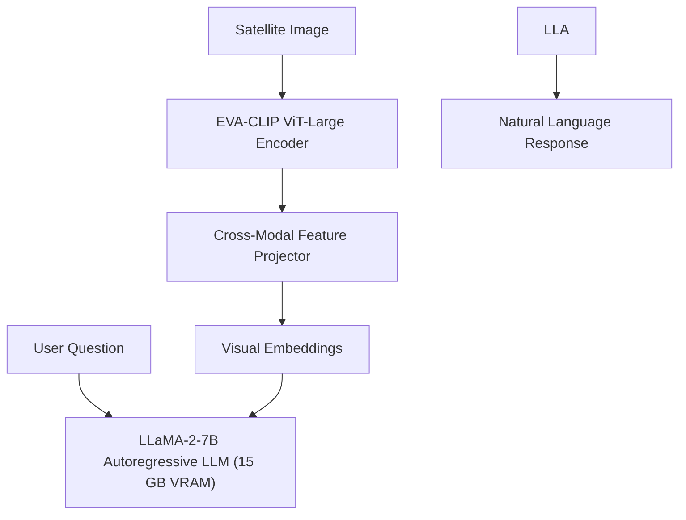

# Model Dossier: RSCoVLM (Evaluation Candidate — Not Adopted)

---

# 1. Model Identity
- **Model Name**: RSCoVLM
- **Official Name**: RSCoVLM: Remote Sensing Cross-Modal Vision-Language Model
- **Model Family**: LLaMA-2 Remote-Sensing Vision-Language Architecture
- **Version**: 1.0 (IEEE TGRS 2024)
- **Model Type**: 7.5B Parameter Multimodal Autoregressive Transformer
- **Task**: Remote Sensing Scene Interpretation & Visual Question Answering
- **Modality**: Optical Satellite Imagery + Natural Language Questions
- **SatQuery Role**: Evaluated research candidate for general remote-sensing VQA.
- **Current Status**: EVALUATED CANDIDATE — NOT ADOPTED (NOT CONFIGURED IN PRODUCTION DUE TO RESOURCE CONSTRAINTS)

---

# 2. Executive Summary
RSCoVLM (IEEE TGRS 2024) was evaluated alongside EarthDial and GeoChat during SatQuery's vision-language model benchmarking phase (`results/vlm_model_comparison.json`). Combining EVA-CLIP visual encoding with a 7B LLaMA-2 language decoder, it delivers 86.2% accuracy on the RSVQA Low Resolution (LR) benchmark. However, because its **15 GB VRAM footprint** exceeds consumer GPU limits, it was not adopted for deployment. Production conversational VQA in SatQuery AI is served by the lightweight 1.54 GB `GeneralRSVLM` (BLIP-VQA).

---

# 3. Official Source
- **Official Paper**: IEEE Transactions on Geoscience and Remote Sensing (TGRS 2024).
- **Official Repository**: GitHub (Academic release)
- **Official License**: Research / Academic Use

---

# 4. Research Background
Most vision-language models struggle to comprehend multi-scale object density in remote sensing. RSCoVLM addressed this by employing an enhanced cross-modal visual encoder trained specifically on paired remote-sensing corpora.

---

# 5. Architecture
- **Visual Encoder**: EVA-CLIP ViT-Large backbone.
- **Projection Layer**: Cross-attention feature adapter.
- **Language Model**: LLaMA-2-7B.
- **Total Parameters**: ~7.5 Billion parameters.

---

# 6. INTERNAL DATA FLOW

---

# 7. Parameter / Configuration Specification
- **Total Parameters**: ~7.5 Billion (OFFICIAL)
- **Visual Encoder**: EVA-CLIP ViT-L (OFFICIAL)
- **Language Decoder**: LLaMA-2-7B (OFFICIAL)
- **Hardware Requirement**: $\ge 16\text{ GB GPU VRAM}$ (OFFICIAL)

---

# 8. CHECKPOINT
- **Checkpoint**: Not stored or configured in SatQuery AI.
- **Status**: EVALUATION CANDIDATE ONLY.

---

# 9. DATASET / TRAINING DATA
- **UPSTREAM TRAINING DATA**: Trained on RSVQA, Sydney Captions, and synthetic instruction sets.
- **SATQUERY TRAINING DATA**: SatQuery did not train this model.

---

# 10. PREPROCESSING
- Requires standard EVA-CLIP image preprocessing and LLaMA tokenizer formatting.

---

# 11. INFERENCE PIPELINE
- Vision Transformer forward pass $\to$ Projection $\to$ Causal language generation.

---

# 12. SATQUERY INTEGRATION
- Documented in `docs/SATQUERY_AI_MASTER_DOCUMENTATION.md` (Section 7.1) as an evaluated candidate.
- Status in runtime registry: `NOT_CONFIGURED`.

---

# 13. AGENT ORCHESTRATION ROLE
- None.

---

# 14. INPUT CONTRACT
- Image + String Query.

---

# 15. OUTPUT CONTRACT
- Text String Answer.

---

# 16. POSTPROCESSING
- Text string cleanup.

---

# 17. VALIDATION
- Upstream benchmark comparison.

---

# 18. BENCHMARKS
- **OFFICIAL UPSTREAM BENCHMARKS**:
  - RSVQA Low Resolution (RSVQA-LR): **86.2% Accuracy** (OFFICIAL)

---

# 19. SATQUERY RESULTS
- **Status**: Evaluated conceptually; rejected due to VRAM requirements.

---

# 20. ERROR / FAILURE MODES
- **Out Of Memory**: Requires dual GPUs or high-end workstation hardware.

---

# 21. LIMITATIONS
- Incompatible with lightweight edge/laptop deployment; no native segmentation mask output.

---

# 22. WHY SATQUERY EVALUATED THIS MODEL
- Evaluated to benchmark open-vocabulary remote-sensing VQA performance.

---

# 23. WHY NOT ADOPTED
- Extremely heavy resource footprint (15 GB VRAM) without providing pixel segmentation or temporal change detection capabilities.

---

# 24. SATQUERY MODIFICATIONS
- None.

---

# 25. Reproducibility
- Documented as an external research candidate.

---

# 26. Files in This Repository
- `docs/SATQUERY_AI_MASTER_DOCUMENTATION.md` (Section 7.1)

---

# 27. References
- RSCoVLM: Remote Sensing Cross-Modal Vision-Language Model. IEEE TGRS 2024.
