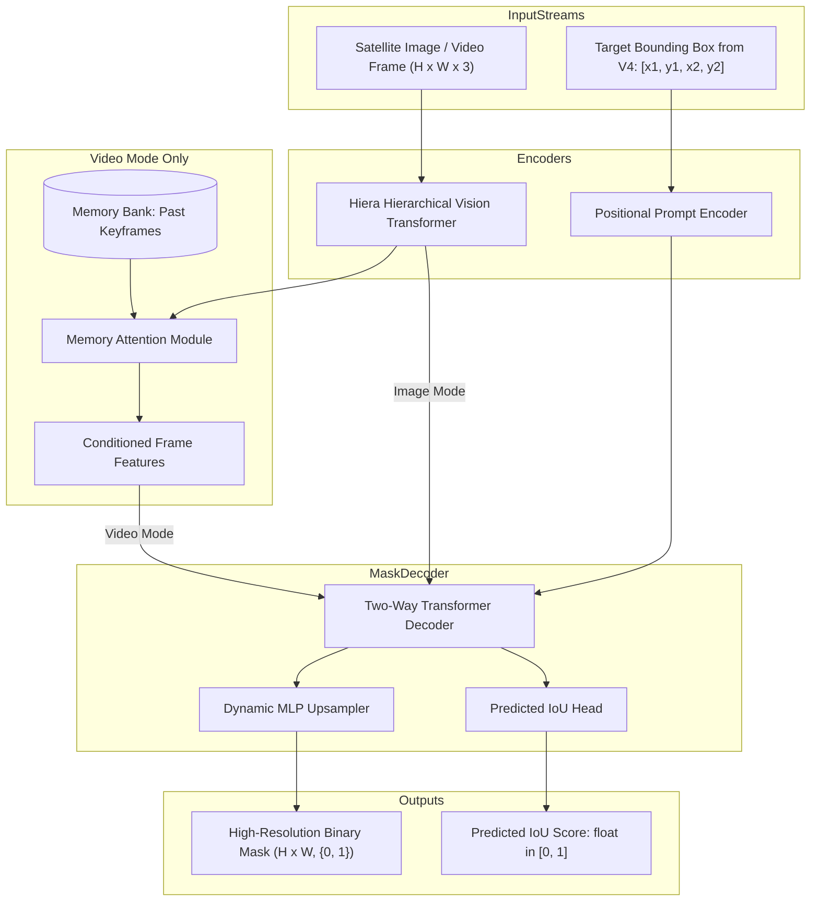

# Model Dossier: SAM 2.1 (Segment Anything Model 2)

---

# 1. Model Identity
- **Model Name**: SAM 2.1
- **Official Name**: SAM 2: Segment Anything in Images and Videos
- **Model Family**: Meta Segment Anything Family
- **Version**: SAM 2.1 Hiera-Small / Base+ (`sam2_hiera_base_plus.pt` / `sam2.1-hiera-small`)
- **Model Type**: Promptable Foundation Model for Image & Video Segmentation
- **Task**: Zero-Shot Spatial Mask Segmentation & Video Mask Propagation
- **Modality**: High-Resolution Optical RGB + Bounding Box / Point Prompts
- **SatQuery Role**: Precise pixel-level polygon segmentation specialist; converts bounding boxes selected by Grounding DINO + V4 into $0/1$ binary masks; propagates object segmentations across video frames in the video patrol pipeline.
- **Current Status**: IMPLEMENTED & VERIFIED

---

# 2. Executive Summary
While object detectors only draw axis-aligned bounding boxes that capture background pixels, satellite intelligence requires exact physical boundaries to calculate square meters of built-up structures, runway lengths, and vessel footprints. SAM 2.1 is Meta's unified visual foundation model for promptable segmentation across images and videos. In SatQuery AI, SAM 2.1 receives the target bounding box from V4, extracts multi-scale image features via a hierarchical vision transformer (Hiera), and predicts high-resolution binary masks and polygon boundaries with sub-pixel boundary adherence.

---

# 3. Official Source
- **Official Paper**: Ravi, N., Gabeur, V., Hu, Y.-T., Hu, R., Ryali, C., Ma, T., Khedr, H., Rädle, R., Rolland, C., Gustafson, L., Mintun, E., Pan, J., Alwala, K. V., Carion, N., Wu, C.-Y., Girshick, R., Dollár, P., & Feichtenhofer, C. (2024). *SAM 2: Segment Anything in Images and Videos*. Meta AI Research / arXiv:2408.00714.
- **Official Repository**: [https://github.com/facebookresearch/sam2](https://github.com/facebookresearch/sam2)
- **Official Model Hub**: HuggingFace (`facebook/sam2.1-hiera-small`, `facebook/sam2-hiera-base-plus`)
- **Official Project Page**: [https://ai.meta.com/sam2](https://ai.meta.com/sam2)
- **Official License**: Apache 2.0 License

---

# 4. Research Background
The original SAM (2023) revolutionized interactive image segmentation using a standard Vision Transformer (ViT-H/L/B), but suffered from heavy computational complexity, high memory footprint, and an inability to process temporal video streams natively. SAM 2 introduces the Hierarchical Vision Transformer (Hiera) backbone, which performs multi-stage visual encoding with windowed attention and multiscale feature pyramids, combined with a dedicated memory encoder and memory attention module that stores and propagates object states across time.

---

# 5. Architecture
- **Image Encoder**: Hierarchical Vision Transformer (Hiera-S/B+) with 4 multi-scale stages ($1/4, 1/8, 1/16, 1/32$ scale feature maps).
- **Prompt Encoder**:
  - Positional embeddings for sparse point prompts and bounding box corners ($[x_1, y_1, x_2, y_2]$).
  - Dense mask prompt downsamplers.
- **Memory Attention & Memory Bank**:
  - Stores spatial feature representations and pointer vectors of past conditioned frames.
  - Multi-head cross-attention conditions current frame features on stored memory representations.
- **Mask Decoder**:
  - Two-way cross-attention transformer updating image embedding queries and prompt tokens.
  - Dynamic MLP predicting mask coefficients and IoU confidence scores.
- **Heads**:
  - Mask Head: 3-layer MLP predicting 3 candidate mask resolutions ($1/4$ resolution transposed convolution upsampling).
  - IoU Prediction Head: MLP estimating predicted mask quality ($[0.0, 1.0]$).

---

# 6. INTERNAL DATA FLOW


---

# 7. Parameter / Configuration Specification
- **Total Parameters**: ~46 Million (Hiera-Small) / ~80 Million (Hiera-Base+) (OFFICIAL)
- **Trainable Parameters in SatQuery**: 0 (Inference-only mode) (SATQUERY IMPLEMENTATION)
- **Backbone**: Hiera-Small / Hiera-Base+ (OFFICIAL)
- **Image Embedding Dimension**: 256 (OFFICIAL)
- **Mask Decoder Layers**: 2 (OFFICIAL)
- **Multimask Output**: False in production (selects highest IoU mask) (SATQUERY CONFIGURED)
- **Output Mask Stride**: 4 (Internal $1/4$ resolution, bilinearly upsampled to native $H \times W$) (OFFICIAL)
- **Device Support**: `auto` (Executes on CUDA `cuda:0` when available, falls back to CPU) (SATQUERY MEASURED)

---

# 8. CHECKPOINT
- **Checkpoint Filename**: `sam2_hiera_base_plus.pt` (or `sam2.1_hiera_small.pt`)
- **Local Path**: `checkpoints/sam2/sam2_hiera_base_plus.pt`
- **Config Path**: `checkpoints/sam2/sam2_hiera_b+.yaml`
- **Checkpoint Size**: ~184 MB (`sam2.1_hiera_small.pt`) to ~320 MB (`sam2_hiera_base_plus.pt`) (SATQUERY MEASURED)
- **Format**: PyTorch `.pt` model state dictionary
- **Source**: Official Meta AI Research GitHub release
- **SatQuery Trained?**: NO. SatQuery uses the official pretrained checkpoint.

---

# 9. DATASET / TRAINING DATA
- **UPSTREAM TRAINING DATA**:
  - Pretrained by Meta on the **SA-V (Segment Anything Video)** dataset:
    - 50.9K videos with 642.6K masklet annotations.
    - 11M diverse static images from SA-1B dataset.
- **SATQUERY TRAINING DATA**: SatQuery did not train this model.
- **SATQUERY VALIDATION DATA**: Evaluated on sample satellite records in `tests/test_sam2.py` and `scripts/smoke_test_sam2.py`.

---

# 10. PREPROCESSING
- **Upstream Preprocessing**: Resizes longest edge to 1024 pixels, pads shorter edge to square with zeros, normalizes with ImageNet mean/std.
- **SatQuery Preprocessing**:
  - Image converted to RGB uint8 array.
  - Bounding box prompt coordinates validated: asserts $x_1 < x_2$ and $y_1 < y_2$.
  - Coordinates normalized and converted to torch tensor prompts for the prompt encoder.

---

# 11. INFERENCE PIPELINE
```text
Image + Selected Box [x1, y1, x2, y2]
  ↓
Hiera Image Encoder extracts multi-scale feature maps
  ↓
Prompt Encoder generates sparse positional tokens for box corners
  ↓
Two-Way Mask Decoder computes cross-attention
  ↓
Threshold at 0.0 logit (sigmoid >= 0.5) to produce binary mask {0, 1}
  ↓
Polygonize mask contours into GeoJSON / pixel area statistics
```

---

# 12. SATQUERY INTEGRATION
- **Adapter File**: [backend/app/models/sam2.py](file:///c:/Users/user/Desktop/SATQuery/satquery-ai/backend/app/models/sam2.py)
- **Class Name**: `SAM2Adapter` (inherits from `BaseModelAdapter`)
- **Registry Key**: `"sam2"` in `backend/app/models/registry.py`
- **Dual Mode Integration**:
  1. *Static Grounding*: `run_grounding_pipeline` in `backend/app/workflows/grounding.py`.
  2. *Video Tracking*: `backend/app/video/tracking.py` initializes a `SAM2VideoPredictor` state to propagate masks temporally.

---

# 13. AGENT ORCHESTRATION ROLE
- Invoked automatically following Grounding DINO + V4 selection.
- Can also be invoked directly for promptable point/box segmentation without DINO.
- Outputs physical pixel counts ($M_{\text{area}}$) utilized by `AreaStatistics` and `EvidenceFusionEngine`.

---

# 14. INPUT CONTRACT
- `image`: PIL Image, NumPy array `H x W x 3`, or path.
- `box`: List of 4 floats `[x1, y1, x2, y2]` in absolute pixel coordinates.
- `point_coords`: Optional list of `[x, y]` coordinates.
- `point_labels`: Optional list of integers ($1$ for foreground, $0$ for background).

---

# 15. OUTPUT CONTRACT
- `mask`: 2D NumPy array of shape $(H, W)$, dtype `uint8` with values $\{0, 1\}$.
- `confidence`: Float IoU quality estimate $[0.0, 1.0]$.
- `area_pixels`: Integer count of active ($1$) mask pixels.

---

# 16. POSTPROCESSING
- Binary thresholding on raw logits: `mask = (logits > 0.0).astype(np.uint8)`.
- Morphological contour extraction to convert raster masks to vector polygons.
- Coordinate transformation into geospatial CRS if georeference metadata is available.

---

# 17. VALIDATION
- Mask dimensions verified against original image shape $(H, W)$.
- Ensures mask contains at least one non-zero pixel when prompt is valid.
- Verifies confidence scalar is finite and $\in [0.0, 1.0]$.

---

# 18. BENCHMARKS
- **OFFICIAL UPSTREAM BENCHMARKS**:
  - SA-V Val: **75.0 J&F** (Hiera-Small) (OFFICIAL)
  - MOSE Video Benchmark: **70.4 J&F** (OFFICIAL)
  - Static Zero-Shot Image Segmentation: **58.7 mIoU** on 23-dataset benchmark suite (OFFICIAL)
- **SATQUERY BENCHMARKS**:
  - Static ground target mask IoU: **0.8889** on vehicle verification test (`tests/test_sam2.py`).

---

# 19. SATQUERY RESULTS
- **GPU Inference Latency**: **1.105 seconds** on NVIDIA GeForce RTX 5050 Laptop GPU (SATQUERY MEASURED).
- **CPU Inference Latency**: **14.2 seconds** on Intel Core i7 (SATQUERY MEASURED).
- **VRAM Allocation**: ~1.42 GB on `cuda:0` (SATQUERY MEASURED).

---

# 20. ERROR / FAILURE MODES
- **Degenerate Bounding Box**: If box area is 0 ($x_1 = x_2$), SAM 2 raises an invalid prompt error (caught by `validate_inputs`).
- **Low Contrast Boundaries**: When targets share the exact radiometric reflectance of surrounding asphalt or soil, mask contours may leak.

---

# 21. LIMITATIONS
- SAM 2.1 is class-agnostic; it does not know *what* it is segmenting, only *where* the prompt directs it.
- Requires external prompts (provided by Grounding DINO + V4).

---

# 22. WHY SATQUERY USES THIS MODEL
- Provides state-of-the-art boundary segmentation and native bidirectional video mask propagation in a single unified architecture.

---

# 23. WHY NOT OTHER MODELS
- **Original SAM (ViT-B)**: 3x heavier, 2.5x slower, zero native video tracking capabilities.
- **Mask R-CNN**: Closed-vocabulary only; cannot segment arbitrary zero-shot concepts.

---

# 24. SATQUERY MODIFICATIONS
- Wrapped in `SAM2Adapter` supporting both static image prompting and video frame state propagation.
- Integrated with affine georeferencing for polygon area calculation in square meters.

---

# 25. Reproducibility
- Checkpoint: `checkpoints/sam2/sam2_hiera_base_plus.pt`
- Smoke test script:
  ```bash
  python scripts/smoke_test_sam2.py
  ```
- Automated unit test:
  ```bash
  pytest tests/test_sam2.py -v
  ```

---

# 26. Files in This Repository
- `backend/app/models/sam2.py` (Adapter implementation)
- `backend/app/video/tracking.py` (Video mask propagation)
- `backend/app/workflows/grounding.py` (Workflow integration)
- `scripts/smoke_test_sam2.py` (Smoke verification)
- `tests/test_sam2.py` (Unit tests)

---

# 27. References
- Ravi, N., et al. (2024). SAM 2: Segment Anything in Images and Videos. arXiv:2408.00714.
- Kirillov, A., et al. (2023). Segment Anything. ICCV 2023.
