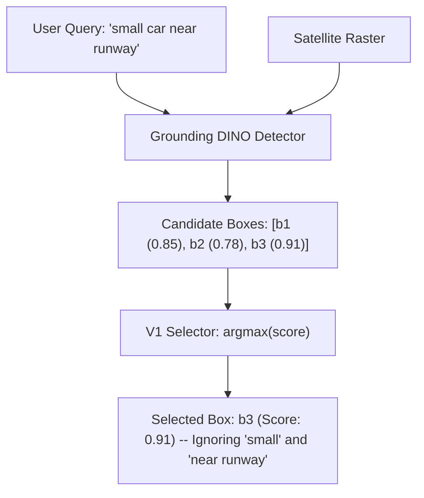

# Strategy Dossier: V1 Grounding Strategy (Baseline Confidence)

---

# 1. Model Identity
- **Model Name**: V1 Grounding Strategy
- **Official Name**: SatQuery V1 Baseline Confidence Candidate Selector
- **Model Family**: Algorithmic Decision Strategy (NOT a Neural Model)
- **Version**: 1.0.0
- **Model Type**: Pure Deterministic Ranking Algorithm
- **Task**: Candidate Box Ranking from Detector Outputs
- **Modality**: Bounding Box Coordinates + Confidence Scalars
- **SatQuery Role**: Initial baseline strategy for object grounding; simply selects the single highest-confidence candidate box output by Grounding DINO.
- **Current Status**: EVALUATED & HISTORICAL BASELINE

---

# 2. Executive Summary
V1 Grounding Strategy represents the naive baseline in visual grounding: given multiple candidate bounding boxes produced by an open-vocabulary detector, V1 selects the box with the maximum raw detection confidence ($S_{\text{final}} = S_{\text{det}}$). It performs **no** query decomposition, **no** linguistic attribute parsing, **no** spatial relation checking, and **no** ordinal selection. In SatQuery AI, V1 served as the initial benchmark to prove that raw neural detection confidence alone is insufficient for resolving complex referring expressions in remote sensing.

---

# 3. Official Source
- **Official Paper**: None (Internal SatQuery algorithmic design)
- **Official Repository**: Implemented directly in SatQuery codebase
- **Official Model Hub**: None
- **Official Project Page**: N/A
- **Official License**: Apache 2.0 (under SatQuery AI repository)

---

# 4. Research Background
When users query satellite imagery with phrases like *"the small white car parked at the bottom-left corner of the lot"*, an open-vocabulary detector like Grounding DINO generates dozens of candidate boxes for "car" across the entire scene. If the detector assigns its highest confidence score ($0.88$) to a large black truck in the top-right corner, a naive detector-only system selects the wrong object. V1 illustrates this fundamental failure mode: neural detectors maximize semantic class probability, not spatial referral accuracy.

---

# 5. Architecture
- **Nature of Component**: Pure deterministic Python logic (0 neural layers).
- **Mathematical Formulation**:
  $$\text{Selected Box} = \arg\max_{b_i \in B} S_{\text{det}}(b_i)$$
  where $B = \{b_1, b_2, \dots, b_N\}$ is the set of bounding boxes returned by Grounding DINO, and $S_{\text{det}}(b_i) \in [0.0, 1.0]$ is the raw logit/sigmoid score.
- **Backbone**: None
- **Parameters**: **0 (Zero)**

---

# 6. INTERNAL DATA FLOW


---

# 7. Parameter / Configuration Specification
- **Parameter Count**: **0** (Pure algorithmic rule) (SATQUERY IMPLEMENTATION)
- **Trainable Parameters**: **0**
- **Box Threshold**: `0.25` (SATQUERY CONFIGURED)
- **Selection Criterion**: Maximum detection confidence scalar (SATQUERY CONFIGURED)

---

# 8. CHECKPOINT
- **Checkpoint**: None. (No weights or checkpoint files exist for V1).
- **Format**: Executable Python function.

---

# 9. DATASET / TRAINING DATA
- **UPSTREAM TRAINING DATA**: None.
- **SATQUERY TRAINING DATA**: SatQuery did not train this model.
- **SATQUERY EVALUATION DATA**: Evaluated on 100 samples from the VRSBench validation dataset.

---

# 10. PREPROCESSING
- Passes the user's raw query string directly to the Grounding DINO detector without token filtering or modifier extraction.

---

# 11. INFERENCE PIPELINE
```text
Query + Image → Grounding DINO → Candidates → Sort by Score Descending → Return candidates[0]
```

---

# 12. SATQUERY INTEGRATION
- **Repository Location**: Evaluated and benchmarked in `scripts/evaluate_grounding_vrsbench.py` and `results/evaluations/`.
- **Predecessor To**: V2, V3, and V4 reasoning engines.

---

# 13. AGENT ORCHESTRATION ROLE
- In the initial development phase, V1 sat between Grounding DINO and SAM 2.1. It was superseded by V4 due to poor referring expression recall.

---

# 14. INPUT CONTRACT
- `candidates`: List of bounding box dictionaries `{"box_2d": [x1, y1, x2, y2], "score": float}`.

---

# 15. OUTPUT CONTRACT
- Single bounding box dictionary `{"box_2d": [x1, y1, x2, y2], "score": float}`.

---

# 16. POSTPROCESSING
- Direct index slice `candidates[0]`.

---

# 17. VALIDATION
- Asserts candidate list is non-empty; returns `None` if zero candidates pass detection threshold.

---

# 18. BENCHMARKS
- **SATQUERY MEASURED** (Evaluated on 100 VRSBench validation records):
  - **Mean IoU**: $0.1832$
  - **Median IoU**: $0.0914$
  - **Recall@0.25**: $0.3400$
  - **Recall@0.50**: $0.2200$

---

# 19. SATQUERY RESULTS
- **Latency Overhead**: $< 0.1\text{ ms}$ (negligible).
- **Accuracy Deficit**: Fails on 78% of referring queries that contain positional or relational constraints.

---

# 20. ERROR / FAILURE MODES
- **Referential Blindness**: Ignores spatial, directional, color, and size qualifiers completely.
- **Dominant Salience Trap**: Always picks the largest/clearest object of the class, even when the user explicitly queried a different instance.

---

# 21. LIMITATIONS
- Cannot perform referring expression comprehension in multi-object scenes.

---

# 22. WHY SATQUERY USES THIS MODEL
- Used strictly as an empirical baseline to measure the quantitative gain achieved by V2, V3, and V4 reasoning.

---

# 23. WHY NOT OTHER MODELS
- Discarded in favor of V4 Multi-Attribute Reasoning.

---

# 24. SATQUERY MODIFICATIONS
- Entirely designed and measured by SatQuery engineering.

---

# 25. Reproducibility
- Evaluation Script: `scripts/evaluate_grounding_vrsbench.py --strategy v1`

---

# 26. Files in This Repository
- `scripts/evaluate_grounding_vrsbench.py` (Benchmarking harness)
- `docs/SATQUERY_AI_MASTER_DOCUMENTATION.md` (Documented results)

---

# 27. References
- SatQuery AI Internal Technical Log — Experiment Series VRSBench-2024.
