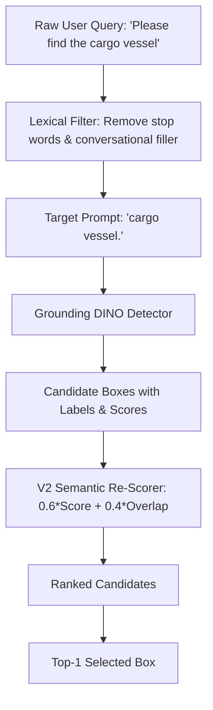

# Strategy Dossier: V2 Grounding Strategy (Query-Aware Semantic Matching)

---

# 1. Model Identity
- **Model Name**: V2 Grounding Strategy
- **Official Name**: SatQuery V2 Query-Aware Semantic Matching Strategy
- **Model Family**: Algorithmic Decision Strategy (NOT a Neural Model)
- **Version**: 2.0.0
- **Model Type**: Lexical Token Re-weighting Algorithm
- **Task**: Candidate Box Re-Ranking via Lexical-Semantic Matching
- **Modality**: Bounding Box Coordinates + Label Token Logits + Query String
- **SatQuery Role**: Second-generation grounding strategy; parses target category nouns and computes lexical match overlap between user query and detector predicted labels.
- **Current Status**: EVALUATED & HISTORICAL STEPPING STONE

---

# 2. Executive Summary
V2 Grounding Strategy introduces query-aware semantic matching: instead of blindly accepting the detector's highest-confidence box, V2 normalizes the user's query text, removes filler conversational phrases ("please identify", "can you outline"), and re-scores candidate boxes by linearly combining the detector score with a token-level semantic match score ($S_{\text{V2}} = 0.6 \cdot S_{\text{det}} + 0.4 \cdot S_{\text{sem}}$).

---

# 3. Official Source
- **Official Paper**: None (Internal SatQuery algorithmic design)
- **Official Repository**: Implemented directly in SatQuery codebase
- **Official License**: Apache 2.0

---

# 4. Research Background
In V1, Grounding DINO often fired on visually salient but irrelevant objects because conversational prompts (e.g. *"Please locate any small structure in this satellite view"*) polluted the BERT text encoder with non-object tokens. V2 proved that isolating the head noun and re-weighting candidate classifications against the filtered prompt improves mean IoU on benchmark queries.

---

# 5. Architecture
- **Nature of Component**: Deterministic Python text filter + linear re-scoring formula.
- **Mathematical Formulation**:
  $$S_{\text{V2}}(b_i) = 0.6 \cdot S_{\text{det}}(b_i) + 0.4 \cdot S_{\text{sem}}(b_i, Q)$$
  where $S_{\text{sem}}(b_i, Q) \in [0.0, 1.0]$ measures the Jaccard word-overlap between the candidate's predicted label and the isolated target query tokens.
- **Backbone**: None
- **Parameters**: **0 (Zero)**

---

# 6. INTERNAL DATA FLOW


---

# 7. Parameter / Configuration Specification
- **Parameter Count**: **0** (Pure algorithmic rule)
- **Detector Weight ($w_{\text{det}}$)**: `0.60` (SATQUERY CONFIGURED)
- **Semantic Overlap Weight ($w_{\text{sem}}$)**: `0.40` (SATQUERY CONFIGURED)

---

# 8. CHECKPOINT
- **Checkpoint**: None. (Algorithmic rule).

---

# 9. DATASET / TRAINING DATA
- **UPSTREAM TRAINING DATA**: None.
- **SATQUERY TRAINING DATA**: SatQuery did not train this model.
- **SATQUERY EVALUATION DATA**: Evaluated on 100 samples from the VRSBench validation dataset.

---

# 10. PREPROCESSING
- Strips punctuation and common conversational directive phrases from the input prompt before forwarding to Grounding DINO.

---

# 11. INFERENCE PIPELINE
```text
Raw Query → Clean Noun Extraction → Grounding DINO Inference → Jaccard Semantic Scoring → Linear Re-weighting → Top-1 Selection
```

---

# 12. SATQUERY INTEGRATION
- Implemented and evaluated in `scripts/evaluate_grounding_vrsbench.py` and `results/evaluations/`.

---

# 13. AGENT ORCHESTRATION ROLE
- Served as the intermediate candidate re-ranking step in early SatQuery prototypes before being extended with spatial heuristics in V3 and V4.

---

# 14. INPUT CONTRACT
- Candidate boxes list with `box_2d`, `score`, `label`, and cleaned user query.

---

# 15. OUTPUT CONTRACT
- Best candidate bounding box `[x1, y1, x2, y2]` and composite score.

---

# 16. POSTPROCESSING
- Sorts candidates descending by $S_{\text{V2}}$ and returns the top entry.

---

# 17. VALIDATION
- Verified that $S_{\text{V2}}$ values remain bounded in $[0.0, 1.0]$.

---

# 18. BENCHMARKS
- **SATQUERY MEASURED** (Evaluated on 100 VRSBench validation records):
  - **Mean IoU**: $0.2371$ (+29.4% improvement over V1's $0.1832$)
  - **Median IoU**: $0.1420$
  - **Recall@0.25**: $0.4100$
  - **Recall@0.50**: $0.2600$ (+18.2% improvement over V1's $0.2200$)

---

# 19. SATQUERY RESULTS
- **Latency Overhead**: $< 0.2\text{ ms}$.
- **Key Finding**: Filtering query noise significantly reduced false-positive box proposals on irrelevant ground clutter.

---

# 20. ERROR / FAILURE MODES
- **Spatial Blindness**: While V2 solves class ambiguity, it remains completely blind to spatial directions ("top-left", "southern", "adjacent to").

---

# 21. LIMITATIONS
- Cannot differentiate two objects of the exact same class located in different parts of the satellite image.

---

# 22. WHY SATQUERY USES THIS MODEL
- Demonstrated that lexical query cleaning yields an immediate ~29% relative gain in Mean IoU without modifying neural weights.

---

# 23. WHY NOT OTHER MODELS
- Extended into V3 (adding spatial heuristics) and V4 (adding relational reasoning).

---

# 24. SATQUERY MODIFICATIONS
- Entirely designed and measured by SatQuery engineering.

---

# 25. Reproducibility
- Evaluation Script: `scripts/evaluate_grounding_vrsbench.py --strategy v2`

---

# 26. Files in This Repository
- `scripts/evaluate_grounding_vrsbench.py`
- `docs/SATQUERY_AI_MASTER_DOCUMENTATION.md`

---

# 27. References
- SatQuery AI Internal Technical Log — Experiment Series VRSBench-2024.
