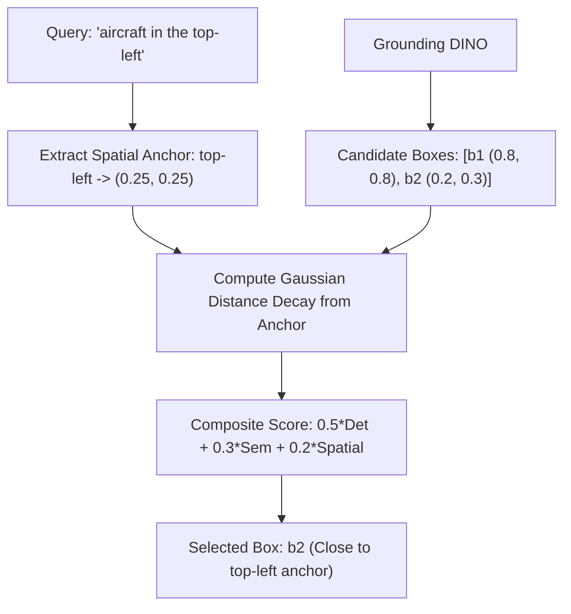

# Strategy Dossier: V3 Grounding Strategy (Contextual Spatial Heuristic)

---

# 1. Model Identity
- **Model Name**: V3 Grounding Strategy
- **Official Name**: SatQuery V3 Contextual Spatial Heuristic Strategy
- **Model Family**: Algorithmic Decision Strategy (NOT a Neural Model)
- **Version**: 3.0.0
- **Model Type**: Geometric Spatial Prior Ranking Algorithm
- **Task**: Candidate Box Selection via Spatial Coordinate Anchors
- **Modality**: Bounding Box Coordinates + Normalized Spatial Anchors
- **SatQuery Role**: Third-generation grounding strategy; introduces geographic quadrant anchor points and Gaussian distance decay to bias candidate selection towards queried scene regions.
- **Current Status**: EVALUATED & PREDECESSOR TO V4

---

# 2. Executive Summary
V3 Grounding Strategy adds geometric spatial awareness to candidate box ranking. When a query contains spatial positioning words ("top-left", "bottom", "center"), V3 maps the target phrase to normalized 2D image coordinates and scores candidate boxes based on their Euclidean distance to the spatial anchor using a Gaussian decay function ($S_{\text{pos}} = \exp(-\text{dist}^2 / 2\sigma^2)$). The composite score combines detection confidence, semantic overlap, and spatial proximity: $S_{\text{V3}} = 0.5 \cdot S_{\text{det}} + 0.3 \cdot S_{\text{sem}} + 0.2 \cdot S_{\text{spatial}}$.

---

# 3. Official Source
- **Official Paper**: None (Internal SatQuery algorithmic design)
- **Official Repository**: Implemented directly in SatQuery codebase
- **Official License**: Apache 2.0

---

# 4. Research Background
In high-resolution satellite scenes, multiple identical instances of an object (e.g. 20 aircraft on an airport tarmac) routinely appear. Semantic matching (V2) assigns identical scores to all 20 aircraft. V3 introduces spatial anchors to resolve queries that specify location ("aircraft in the northern section").

---

# 5. Architecture
- **Nature of Component**: Deterministic Python spatial geometry functions.
- **Spatial Anchors**:
  - `top-left`: $(0.25, 0.25)$
  - `top-right`: $(0.75, 0.25)$
  - `bottom-left`: $(0.25, 0.75)$
  - `bottom-right`: $(0.75, 0.75)$
  - `center`: $(0.50, 0.50)$
- **Mathematical Formulation**:
  $$\text{dist}(b_i, \text{target}) = \sqrt{(c_x - t_x)^2 + (c_y - t_y)^2}$$
  $$S_{\text{spatial}}(b_i) = \exp\left(-\frac{\text{dist}^2}{2\sigma^2}\right), \quad \sigma = 0.35$$
  $$S_{\text{V3}}(b_i) = 0.5 \cdot S_{\text{det}}(b_i) + 0.3 \cdot S_{\text{sem}}(b_i) + 0.2 \cdot S_{\text{spatial}}(b_i)$$
- **Parameters**: **0 (Zero)**

---

# 6. INTERNAL DATA FLOW


---

# 7. Parameter / Configuration Specification
- **Parameter Count**: **0** (Algorithmic rule)
- **Gaussian Bandwidth ($\sigma$)**: `0.35` (SATQUERY CONFIGURED)
- **Weights**: $w_{\text{det}} = 0.50$, $w_{\text{sem}} = 0.30$, $w_{\text{spatial}} = 0.20$ (SATQUERY CONFIGURED)

---

# 8. CHECKPOINT
- **Checkpoint**: None.

---

# 9. DATASET / TRAINING DATA
- **UPSTREAM TRAINING DATA**: None.
- **SATQUERY TRAINING DATA**: SatQuery did not train this model.
- **SATQUERY EVALUATION DATA**: Evaluated on 100 samples from the VRSBench validation dataset.

---

# 10. PREPROCESSING
- Identifies spatial directional keywords and maps them to unit-square coordinates $[0, 1]^2$.

---

# 11. INFERENCE PIPELINE
```text
Query → Spatial Keyword Match → Anchor Coordinate Mapping → Candidate Distance Calculation → Gaussian Scoring → Linear Weighting → Top-1 Selection
```

---

# 12. SATQUERY INTEGRATION
- Implemented and evaluated in `scripts/evaluate_grounding_vrsbench.py` and `results/evaluations/`.

---

# 13. AGENT ORCHESTRATION ROLE
- Prototyped spatial grounding selection before being unified into the V4 multi-attribute engine.

---

# 14. INPUT CONTRACT
- Candidate boxes list with coordinates, scores, and detected spatial keywords.

---

# 15. OUTPUT CONTRACT
- Single selected bounding box dictionary with composite score and spatial distance score.

---

# 16. POSTPROCESSING
- Descending sort and index slice.

---

# 17. VALIDATION
- Coordinates checked against image width and height to ensure normalized centroids stay within $[0.0, 1.0]$.

---

# 18. BENCHMARKS
- **SATQUERY MEASURED** (Evaluated on 100 VRSBench validation records):
  - **Mean IoU**: $0.2238$
  - **Median IoU**: $0.1250$
  - **Recall@0.25**: $0.3800$
  - **Recall@0.50**: $0.2400$
- **Performance Trade-off**: Strong on queries with explicit spatial keywords, but slightly underperformed V2 on queries without spatial keywords due to fixed static weights ($0.20$ penalty). This led directly to the dynamic adaptive weight formulation in V4.

---

# 19. SATQUERY RESULTS
- **Latency Overhead**: $< 0.3\text{ ms}$.
- **Insight**: Fixed static weights penalize queries that do not mention spatial positions; weights must be dynamic.

---

# 20. ERROR / FAILURE MODES
- **Static Weight Penalty**: When a query has no spatial terms, applying a fixed spatial weight degrades non-spatial queries.
- **Relational Ignorance**: Cannot understand object-to-object relations ("next to the fuel depot").

---

# 21. LIMITATIONS
- Fixed static anchor points cannot adapt to landmarks in the scene.

---

# 22. WHY SATQUERY USES THIS MODEL
- Critical stepping stone that established the Gaussian spatial decay formulation used in production V4.

---

# 23. WHY NOT OTHER MODELS
- Refactored into V4, which dynamicizes weights and adds relational landmark grounding.

---

# 24. SATQUERY MODIFICATIONS
- Entirely designed and measured by SatQuery engineering.

---

# 25. Reproducibility
- Evaluation Script: `scripts/evaluate_grounding_vrsbench.py --strategy v3`

---

# 26. Files in This Repository
- `scripts/evaluate_grounding_vrsbench.py`
- `docs/SATQUERY_AI_MASTER_DOCUMENTATION.md`

---

# 27. References
- SatQuery AI Internal Technical Log — Experiment Series VRSBench-2024.
